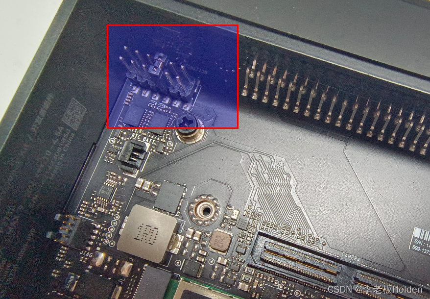
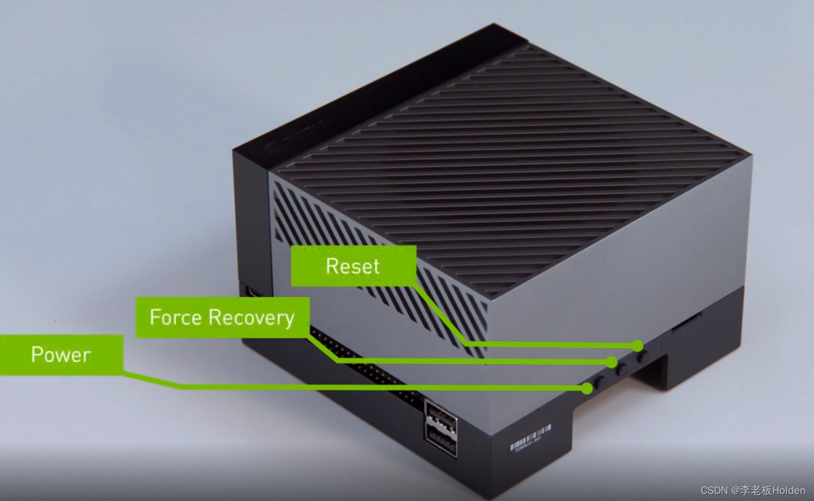

0. 下载安装`orin sdk manager`
1. 移除开机上电的跳针(移除后插上电源不会自动启动)

2. 进入`recorvery`模式

	- 开机情况下，长按强制重启键2， 然后按重启键3， 然后依次松开3、2
	- 关机情况下， 长按强制重启键2， 然后按电源键1， 软件弹出识别窗口后松手。
 3. 下载系统、软件
 4. 按照提示进行烧录(需要选择手动配置模式)
 5. 烧录完成系统后， 将`orin`与电脑连接到同一`wifi`(或使用usb网络，更加稳定)
 6. 填入`orin`的局域网地址，开始烧录相关软件
