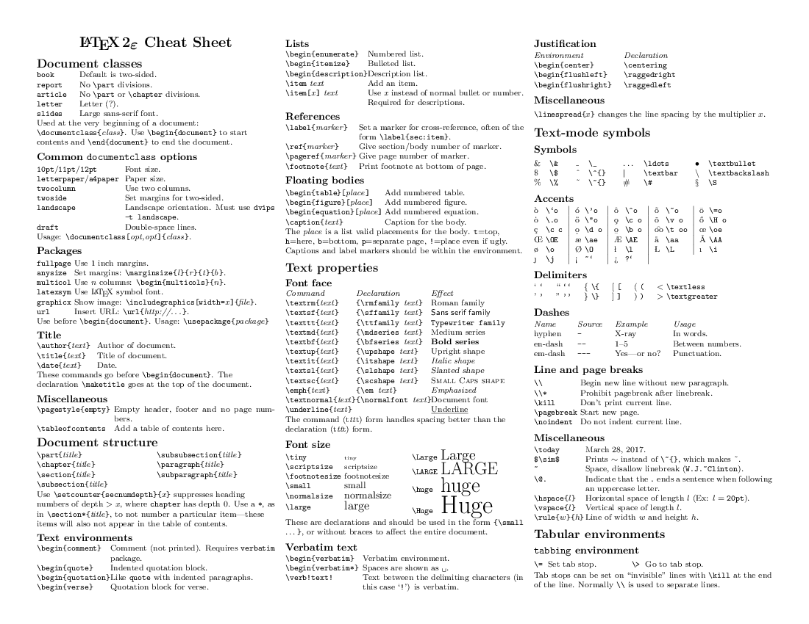
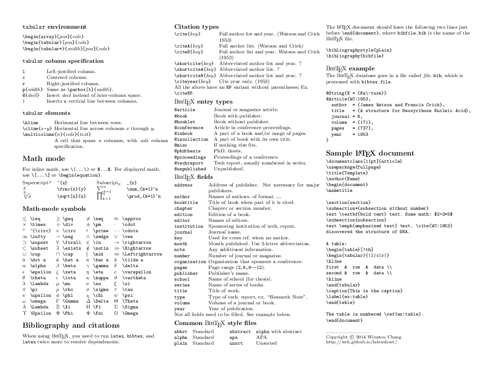

### cheettable

### 高频常用语法
使用的时候，前面都有一个转义符号:\\此处省略.

| 命令行名称          | 说明          | 补充         |                |     |
| -------------- | ----------- | ---------- | -------------- | --- |
| leg            | 小于等于        |            |                |     |
| geg            | 小于等于        |            |                |     |
| approx         | 约等于         |            | $\approx$      |     |
| sum_{}^{}      | 求和符号        |            |                |     |
| overline       | 符号上方的短横线    |            |                |     |
| widetilde      | 符号上方的波浪线    |            |                |     |
| hat            | 符号上方的折线     |            |                |     |
| cdots          | 横向居中的三个点    | 常用于矩阵中     |                |     |
| vdots          | 垂直居中的三个点    | 常用于矩阵中     |                |     |
| ddots          | 对角线方向的三个点   | 常用于矩阵中     |                |     |
| ldots          | 跟文本底线对齐的三个点 | 常用于矢量中     |                |     |
| vec            | 单个字符上加箭头    | 表示向量       |                |     |
| overrightarrow | 多个字符上加箭头    | 表示向量AB     |                |     |
| oplus          | 异或符号        |            |                |     |
| lvert          | 竖           | 绝对值左边      |                |     |
| rvert          | 竖           | 绝对值右边边     |                |     |
| text           | 文本字符        | 用于公式中的字符符号 |                |     |
| frac{}{}       | 除法          |            |                |     |
| partial        | 偏导          |            | $\partial$     |     |
| overline       | 字符上方加横线     |            | $\overline{x}$ |     |
| quad           | 空格          | qquad更大的空格 |                |     |
| nabla          | 倒大三角        | $\nabla$   |                |     |
| gg             | 远大于         |            | $\gg$          |     |
| ll             | 远小于         |            | $\ll$          |     |

不常用希腊字母

| 命令行名称 | 说明     | 补充  |     |
| ----- | ------ | --- | --- |
| \chi  | $\chi$ |     |     |
|       |        |     |     |

- 分组注释
$$
\begin{matrix}\underbrace{cos\theta_c*v_{xr}+sin\theta_c*v_{yr}} \\ v_r\ project\ to\ v_c\end{matrix}-\begin{matrix}\underbrace{(cos\theta_c*v_c*cos\theta_c + sin\theta_c*v_c*sin\theta_c) }\\ v_c \end{matrix}
$$
- 下标\上标(正上方、正下方)
$\mathop{min}\limits_{u_k}^h(\delta{Q}_k)$

