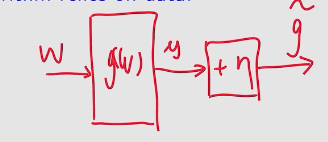
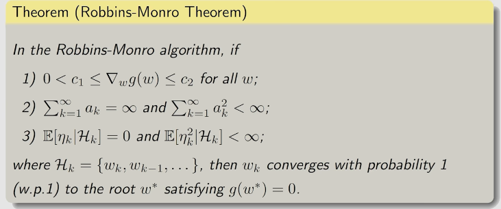

### concept
#### 期望
考虑随机变量$X$， 则$X$的期望定义为:
$$
\begin{equation}
\begin{aligned}
\mathbb{E}[X] &= \sum_{x \in X} x \cdot p(x) \\
\end{aligned}
\end{equation}
\tag{1.1}
$$
如果我们不知道$X$的分布，那么我们可以用样本的平均值来近似$X$的期望(也即蒙特卡洛估计， 服从大数定理)，即:
$$
\begin{equation}
\begin{aligned}
\mathbb{E}[X] &= \frac{1}{N} \sum_{i=1}^{N} x_i \\
\end{aligned}
\end{equation}
\tag{1.2}
$$

当$N\to\infty$时，$\mathbb{E}[X]$收敛于$\mathbb{E}[X]$。

式1.2有两种计算方式:
1. 如果我们采样了所有的$X$，那么带入公式计算即可
2. 如果我们的数据是一帧一帧采样的，那么我们可以用递归的方式获取历史平均， 获取变量的实时估计， 即增量迭代的方法:
对于前k个历史数据的平均值， 定义:
$$
\begin{equation}
\begin{aligned}
w_{k+1} &= \frac{1}{k} \sum_{i=1}^{k} x_i,\space k=1, 2, ...,k \\
\end{aligned}
\end{equation}
\tag{1.3}
$$
显然， 有:
$$
\begin{equation}
\begin{aligned}
w_{k} &= \frac{1}{k-1} \sum_{i=1}^{k-1} x_i,\space k=2, 3, ...\\
\end{aligned}
\end{equation}
\tag{1.4}
$$
故有:
$$
\begin{equation}
\begin{aligned}
w_{k+1} &= \frac{1}{k} \sum_{i=1}^{k} x_i,\space k=1, 2, ...,k \\
&= \frac{1}{k} \left( \sum_{i=1}^{k-1} x_i + x_{k} \right) \\
&= \frac{1}{k} \left( (k-1) \cdot w_k + x_{k} \right) \\
&= \frac{k-1}{k} w_k + \frac{1}{k} x_{k} \\
&=w_k + \frac{1}{k} (x_{k} - w_k) \\
\end{aligned}
\end{equation}
\tag{1.5}
$$
更一般地， 如果把$\frac{1}{k}$替换为系数$\alpha_k$, 则有:
$$
\begin{equation}
\begin{aligned}
w_{k+1} &= w_k + \alpha_k (x_{k} - w_k) \\
\end{aligned}
\end{equation}
\tag{1.6}
$$
> 如果$\alpha_k$满足一些条件， 则$w_k$收敛于$\mathbb{E}[X]$。
#### Stochastic approximation(SA, 随机估计法)
- 一类通过随机采样来逼近未知函数的算法, 经常用于求解方程的解或优化问题。
- 在不知道函数的具体形式的条件下，也无法获取梯度信息，  仍然可以进行求解。

### Robbins-Monro(RM) algorithm
- 随机梯度下降算法是RM的一种特殊情况
#### Problem definition
对于求方程的解的问题:
$$
\begin{equation}
\begin{aligned}
g(w) &= 0 \\
\end{aligned}
\end{equation}
\tag{2.1}
$$
其中$w \in \mathbb{R}$为变量， $g(w): \mathbb{R} \to \mathbb{R}$为函数。
> 优化问题通常与方程求解问题等价
#### RM algorithm
使用RM算法求解方程$g(w) = 0$:
$$
\begin{equation}
\begin{aligned}
w_{k+1} &= w_k - \alpha_k \widetilde{g}(w_k, \eta_k) \\
\end{aligned}
\end{equation}
\tag{2.2}
$$
其中，$g(w)$的形式未知， 故我们转而采用$
\widetilde{g}(w) = g(w) + \eta_k$的输出作为其估计, 其中$\eta_k$为观测噪音。如下图所示:

> 核心是利用函数输出的估计来计算自变量。有什么缺点呢?
> 感觉虽然公式与均值估计都例子一样， 但是思路不一样。本质上有什么联系: g(w) = w - E[x] = 0 $\widetilde{g}(w) = w - x$

- practice: $g(w) = tanh(w-1) = 0$的求解

#### RM算法的收敛性的证明
下面给出RM算法的收敛性定理(证明见书):

其证明可以用Dvoretzky定理来证明: 
TODO

### 随机梯度算法(stochastic gradient descent, SGD)
#### Problem definition
对于优化问题:
$$
\begin{equation}
\begin{aligned}
\min_{w} \mathbb{E}[f(w, X)] \\
\end{aligned}
\end{equation}
\tag{3.1}
$$
其中$w$是待优化参数; $X$是随机变量; $w, X$可以是向量或标量， $f(w, X)$是一个标量。
##### gradient descent algorithm
使用梯度下降算法求解优化问题:
$$
\begin{equation}
\begin{aligned}
w_{k+1} &= w_k - \alpha_k \nabla_w \mathbb{E}[f(w, X)] \\
&=w_k - \alpha_k\mathbb{E}[ \nabla_w f(w, X)] \\
\end{aligned}
\end{equation}
\tag{3.2}
$$
> 梯度下降法也叫最速下降法。需要知道函数的梯度的形式
##### BGD algorithm
使用批量梯度下降算法求解优化问题:
$$
\begin{equation}
\begin{aligned}
\mathbb{E}[\nabla_w f(w, X)] &= \frac{1}{n} \sum_{i=1}^{n} \nabla_w f(w_k, x_i) \\
w_{k+1} &= w_k - \alpha_k \mathbb{E}[\nabla_w f(w, X)] \\
\end{aligned}
\end{equation}
\tag{3.3}
$$
> BGD算法用梯度的采样期望来近似梯度， 从而进行优化迭代。
> 缺点: 一次采样所有数据， 计算量大， 在有些场景数据是时间序列， 无法一次采样所有数据。

##### SGD algorithm
使用梯度的单次随机采样来近似梯度， 从而进行优化迭代:
$$
\begin{equation}
\begin{aligned}
w_{k+1} &= w_k - \alpha_k \nabla_w f(w_k, x_k) \\
\end{aligned}
\end{equation}
\tag{3.4}
$$
> SGD是BGD的特殊情况， $n = 1$
> 证明: SGD is a special RM algorithm, 从而证明其收敛性。
> SGD在距离最优解比较远时收敛的比较快， 接近时比较慢
##### MBSGD(mini-batch SGD) algorithm
使用梯度的多步随机采样来近似梯度， 从而进行优化迭代:
$$
\begin{equation}
\begin{aligned}
\mathbb{E}[\nabla_w f(w, X)] &= \frac{1}{m} \sum_{i=1}^{m} \nabla_w f(w_k, x_i) \\
w_{k+1} &= w_k - \alpha_k \mathbb{E}[\nabla_w f(w, X)] 
\end{aligned}
\end{equation}
\tag{3.5}
$$
> MSGD是BGD的特殊情况， $n = m$

> 随机梯度下降算法仍然需要知道函数的梯度的形式， 只是不需要显式的求解其解析解， 而是通过采样来近似梯度。
