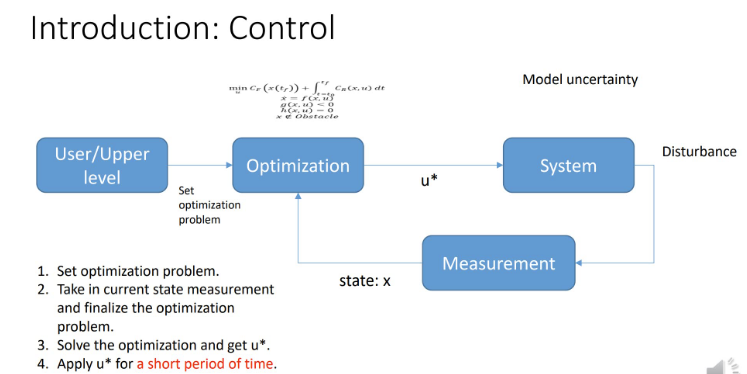
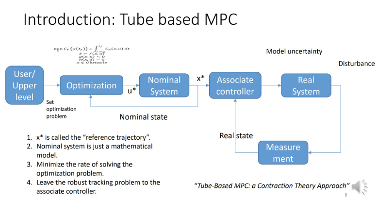

MPC全称叫做Model Predict Control(模型预测控制)。顾名思义， 这是一种利用模型来预测未来一段时间内的状态， 然后综合未来状态作为反馈计算当前时刻的控制输出。
但是MPC这个名称并没有反应它的一个特点， 那就是MPC是一种最优控制方法。
所谓最优控制就是对一个控制系统设计一个代价函数(即对系统表现的期望， 例如能量损耗最小， 平滑性好， 误差最小等等)，然后将代价函数求最小值的问题转化为QP问题(最小二乘)，  然后利用数值优化技术(凸优化， 整数规划等)求解。
MPC还有一个特点在它的名字里面没有体现， 即滚动控制(Receding Horizon Control)的思想， 即在任一时刻， MPC都会根据模型预测优化未来一段时间的状态， 但是只选取最近的控制输入进行实施(因为模型是有误差的， 距离当前时间越远的预测与系统真实的响应差距越大)。从这个角度来说， MPC优化的是系统的平均表现。
### Core Concept
- 需要对系统进行建模(状态转移方程)， 通常需要离散化以便在计算平台上实施
- 本质是求解QP问题, 计算比较耗时， 对平台的计算能力要求较高。
- 由于本质是求解QP问题， 可以在计算的同时施加约束constraints。
- MPC即可以作为规划器，也可以作为控制器

### MPC主要步骤
![MPC steps][../../Resourse/mpc1.png]
> 图片来源: Dr_can

0. 对系统进行建模(应用MPC的前提条件)
1. 在K时刻， 估计/测量当前系统状态(估计一般使用[[卡尔曼滤波]]或设计观测器)
2. 基于未来的控制序列和代价函数$J(x, u)$来进行最优化求解
3. 只取$u_k$施加到系统， 并在下一时刻回到第1步滚动计算(receding horizon control)
### MPC分类
1. 线性MPC
2. 非线性MPC
3. Explicit MPC(离线MPC)
4. tubeMPC
5. MPCC
6. Data-driven MPC
### 系统框图
- 原始MPC

- Tube-base MPC
`Tube MPC`的主要思想是优化求解的输出不直接作用于真实系统，而是作用于我们建立的数学模型(这样就没有真实世界的干扰， 及模型误差)。而且求解的速度可以不要求很高(因为不直接作用于系统)， Associate controller是一个基于系统状态误差的控制器(比如PID)， 它的求解速度可以很快， 同时可以处理真实系统的不确定性。

> `Tube-Based MPC: a Contraction theory approach`
- 事件驱动MPC
### MPC问题推导及求解
线性MPC问题详见[[MPC控制方法]]。

### 相关工具
- acado, 可以代码生成
- Yane, 可以解非线性MPC
- Multi-parametric tool-box
- osqp
- sqp
- particle swarn optimation(无需知道梯度信息)
### MPC求解的稳定性
#### 软约束与硬约束
- 系统状态x一般设计为软约束
- 系统输入u一般设计为硬约束
