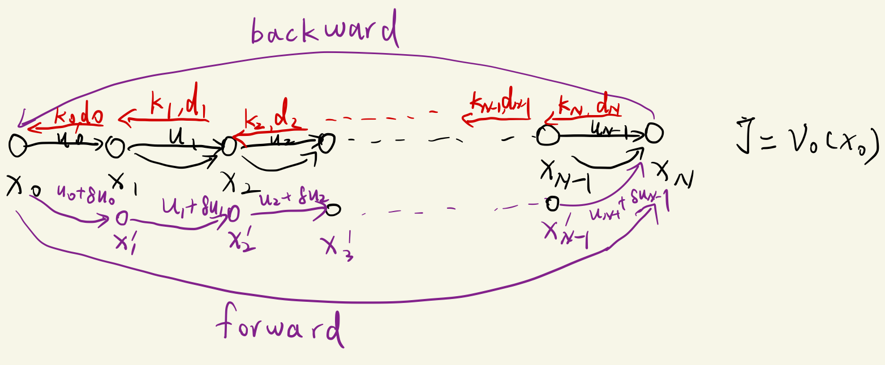
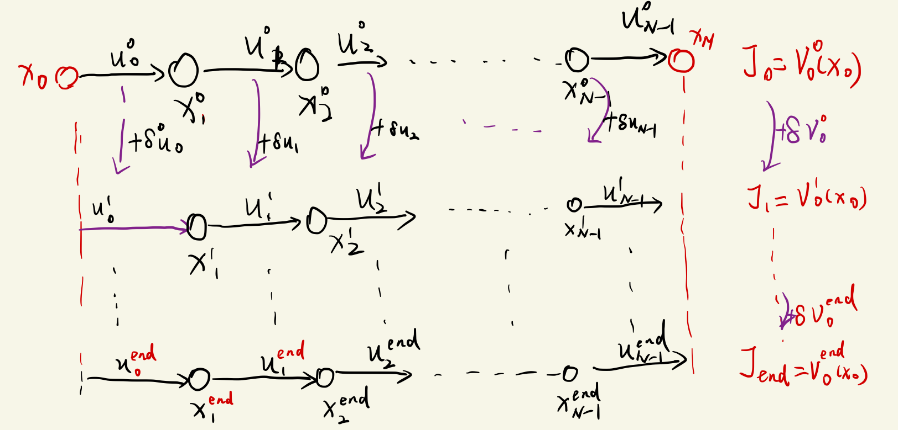

> 本篇文章从以下文章取得理解。
>ref1: [iLQR_Tutorial](https://rexlab.ri.cmu.edu/papers/iLQR_Tutorial.pdf)(本文在该文章的部分内容的基础上，结合自己的理解重新整理了符号系统)
>ref2: [LQR & iLQR Linear Quadratic Regulator](https://jonathan-hui.medium.com/rl-lqr-ilqr-linear-quadratic-regulator-a5de5104c750)(从这篇文章中获取反馈矩阵的形式的理解)
>ref3: [ILQR算法约束处理与内点法DDP](https://zhuanlan.zhihu.com/p/634951102)(从这篇文章中理解到iLQR的本质是对已有轨迹和对应控制的扰动控制，进一步理解了迭代在iLQR语境中的含义)
>ref4: [iLQR--基于最优控制iLQR/DDP的运动规划](https://blog.csdn.net/BigDavid123/article/details/138272291)（从这篇文章理解了iLQR算法的递推过程框架， 并对贝尔曼最优理论有了进一步地理解）
> ref5: [iLQR算法公式推导](https://zhuanlan.zhihu.com/p/660810899)(从这篇文章中理解到iLQR到后文说的$\delta{V}$的用途)

> LQR的算法推导详见[[LQR控制器]].
### core concept
- 对于线性系统的二次型代价函数的最优控制问题而言， 使用LQR可以很高效的计算出一条满足要求的轨迹。其推导可参考[[LQR控制器]] 。
- 但是现实的问题中， 比如车辆的的运动学、动力学方程都是非线性系统(车轮横向运动约束)， 故需要对运动方程及代价函数在采样点进行线性化，然后再应用类似`LQR`控制器推导框架(基于动态规划思想)。
- 在iLQR中本质上是通过施加$\delta{U}$对初始的轨迹进行"扰动"， 从而迭代地在上一次得到轨迹附近找到一条质量更优的轨迹(更低的代价)， 本质上是局部寻优。
- iLQR与DDP方法对区别是， iLQR对非线性动态方程进行一阶泰勒展开， 而DDP则进行二阶展开。
- iLQR需要一条初始轨迹$X$及对应的控制量$U$启动(遗留问题1: 初始轨迹及对应控制量的获取)。
- 本质上， iLQR是满足非线性运动约束的二次型优化问题的一种解法， 理论上我们可以在实施MPC算法的时候用iLQR作为最后优化问题的求解器。
### 推导过程
#### 离散状态转移方程的线性化
对于以下离散状态转移方程， 
$$
\begin{equation}
x_{k+1}=f(x_k, u_k)
\end{equation}
\tag{1.1}
$$
其中状态向量$x$维度为n, 控制向量u的维度为m. 在$(\overline{x}_k, \overline{u}_k)$处线性化， 进行一阶泰勒级数展开(二元函数, 后文均忽略高阶项):
$$
\begin{equation}
\begin{aligned}
\overline{x}_{k+1}+\delta{x_{k+1}}&=f(\overline{x}_k+\delta{x_k}, \overline{u}_k+\delta{u_k}) \\
&\approx f(\overline{x}_k, \overline{u}_k)+\frac{\partial{f}}{\partial{x_k}}(x_k-\overline{x}_k)+\frac{\partial{f}}{\partial{u_k}}(u_k-\overline{u}_k) \\
&=f(\overline{x}_k, \overline{u}_k)+\frac{\partial{f}}{\partial{x_k}}\delta{x_k}+\frac{\partial{f}}{\partial{u_k}}\delta{u_k}
\end{aligned}
\end{equation}
\tag{1.2}
$$
将式(1.1)带入(1.2), 得到: 
$$
\begin{equation}
\begin{aligned}
\delta{x_{k+1}}&=\frac{\partial{f}}{\partial{x_k}}\delta{x_k}+\frac{\partial{f}}{\partial{u_k}}\delta{u_k} \\
&=A_k\delta{x_k}+B_k\delta{u_k}
\end{aligned}
\end{equation}
\tag{1.3}
$$
显然， 矩阵A的维度为$n\times{n}$, 矩阵B的维度为$n\times{m}$, 这里矩阵求导采用分子布局的形式。
#### 代价方程转化为线性二次型的形式
代价方程(Cost Function)的一般形式为:
$$
\begin{equation}
\begin{aligned}
J(x_0, u) = \ell_f(x_N)+\sum^{N-1}_{k=0}\ell_i(x_i, u_i)
\end{aligned}
\end{equation}
\tag{2.1}
$$

> 应该在头脑中明确一点: 无论是$J$还是$\ell$ 函数均是关于向量($x_i$, $u_i$)的标量函数， 既然他们均为标量那么无论里面的矩阵相乘如何运算，其结果均为标量， 总有$a=a^T$ 后文公式推导将不加提醒地反复利用这一点进行同类项的合并。

对非线性代价函数$\ell_k$进行二阶泰勒级数在上一次优化轨迹的参考点($\overline{x}_k$, $\overline{u}_k$)处展开:
$$
\begin{equation}
\begin{aligned}
&\quad \ell_k(x_k+\delta{x}_k,u_k+\delta{u}_k)= 
 \ell_k(\overline{x}_k, \overline{u}_k)+\delta{\ell_k}  \\
&\approx \ell_k(\overline{x}_k, \overline{u}_k)+\frac{\partial{\ell}}{\partial{x_k}}(x_k-\overline{x}_k)+\frac{1}{2}(x_k-\overline{x}_k)^T\frac{\partial^2\ell}{\partial{x_k}^2}(x_k-\overline{x}_k) \\
& \quad +\frac{\partial{\ell}}{\partial{u_k}}(u_k-\overline{u}_k)+\frac{1}{2}(u_k-\overline{u}_k)^T\frac{\partial^2\ell}{\partial{u_k}^2}(u_k-\overline{u}_k) \\
& \quad +\frac{1}{2}(x_k-\overline{x}_k)^T\frac{\partial\ell}{\partial{x_k}}\frac{\partial\ell}{\partial{u_k}}(u_k-\overline{u}_k) \\
& \quad +\frac{1}{2}(u_k-\overline{u}_k)^T\frac{\partial\ell}{\partial{u_k}}\frac{\partial\ell}{\partial{x_k}}(x_k-\overline{x}_k)
\end{aligned}
\end{equation}
\tag{2.2}
$$

由上式可知:
$$
\begin{equation}
\begin{aligned}
\delta{\ell}_k=\left [ \begin{array}{c}
\delta{x}_k \\
\delta{u}_k\\
  \end{array} \right]^T \left [ \begin{array}{c}
\frac{\partial{\ell_k}}{\partial{x}_k} \\
\frac{\partial{\ell_k}}{\partial{u}_k}\\
  \end{array} \right]+ \frac{1}{2}\left [ \begin{array}{c}
\delta{x}_k \\
\delta{u}_k\\
  \end{array} \right]^T\left [ \begin{array}{cc}
 \frac{\partial^2{\ell_k}}{\partial{x}_k^2} &  \frac{\partial^2{\ell_k}}{\partial{x}_k\partial{u_k}}\\
\frac{\partial^2{\ell_k}}{\partial{x}_k\partial{u_k}} & \frac{\partial^2{\ell_k}}{\partial{u}_k^2}\
  \end{array} \right]\left [ \begin{array}{c}
\delta{x}_k \\
\delta{u}_k\\
  \end{array} \right]
\end{aligned}
\end{equation}
\tag{2.3}
$$
我们将偏导重新定义偏导矩阵如下， 后文均采用类似的定义以方便理解：
$$
\left\{
\begin{equation}
\begin{aligned}
\ell_{xx|k}&=\frac{\partial^2\ell_k}{\partial{x_k}^2} \\
\ell_{xu|k}&= \frac{\partial^2\ell_k}{\partial{x_k}\partial{u_k}}\\
l_{ux|k}&= \frac{\partial^2\ell_k}{\partial{u_k}\partial{x_k}}\\
\ell_{uu|k}&=\frac{\partial^2\ell_k}{\partial{u_k}^2} \\
\ell_{x|k}&=\frac{\partial\ell_k}{\partial{x_k}}\\
\ell_{u|k}&=\frac{\partial\ell_k}{\partial{u_k}} \\
\end{aligned}
\end{equation}
\tag{2.4}
\right.
$$
其中$\ell_{xx|k}$下标中$x$表示$\ell$对$x$求一次偏导数， $x$在下标中出现两次表示求的是二阶偏导， 下标$k$表示的是在离散后的系统中是第k步(轨迹中的第k个状态点), 这样定义方便我们理解后文中的递推过程。
#### 动态规划递推关系式
在递推过程中我们用到了[贝尔曼优化思想](https://en.wikipedia.org/wiki/Bellman_equation), 在我们的问题中可表述如下:
首先定义价值函数V为从最后一步N到第k步的代价和(我们后面也是从后向前递推):
$$
\begin{equation}
\begin{aligned}
V_k=min(\ell_f(x_N)+\sum^{N-k}_k{\ell_i(x_i, u_i)})
\end{aligned}
\end{equation}
\tag{2.5}
$$
由于贝尔曼法则(无论系统的初始状态是什么， 系统的最优决策一定是系统在任意最优状态下面的决策都是最优的， 也即系统的最优代价$J_N^*$一定包含$J_k^*$(第k步的最优代价), 其中$k<N$), 对于我们定义的价值函数V， 有: 
$$ 
\begin{equation}
\begin{aligned}
V_k&=min(l_f(x_N)+\sum^{N-k}_k{l_i(x_i, u_)}) \\
&=min(l_k(x_k, u_k)+l_f(x_N)+\sum^{N-K-1}_{k+1}l_i(x_i, u_i)) \\
&=min(l_k(x_k, u_k)+min(l_f(x_N)+\sum^{N-K-1}_{k+1}l_i(x_i, u_i))) \\
&=min(l_k(x_k, u_k)+V_{k+1})
\end{aligned}
\end{equation}
\tag{2.6}
$$
> 是2.6其实就是离散形式的HJB方程

式2.6即我们递归关系式推导的核心, 我们定义Q函数(在贝尔曼公式中称为动作价值函数， 即考虑控制量$u_k$的待优化目标函数):
$$
\begin{equation}
\begin{aligned}
Q_k&=l_k(x_k, u_k)+V_{k+1}(x_{k+1}) \\
&=l_k(x_k, u_k)+V_{k+1}(f(x_k, u_k))
\end{aligned}
\end{equation}
\tag{2.7}
$$
> 注意式2.7中， 我们得到了$Q_k$关于($x_k$, $u_k$)的函数， 其中$\ell_k$的函数是给定的， 我们只需要知道V的函数表达式，便可以应用极值原理令$\frac{\partial{Q_k}}{\partial{u_k}}=0$得到$u_k^*$
---

下面来推导价值函数$V$的形式:
式2.6又可以写为:
$$
\begin{equation}
\begin{aligned}
V_k=min(Q_k)=Q(x_k, u_k^*) = Q_k^*
\end{aligned}
\end{equation}
\tag{2.8}
$$
**即优化后的$Q_k$即为$V_k$, 假设我们已经知道第k步的控制量(决策变量)$u_k^*$, 那么$V_k$是关于$x_k$的函数， 注意在这一步未优化前的$Q_k$是关于$x_k$,$u_k$的函数**
然后我们将$V_k$在$\overline{x}_k$附近进而二阶泰勒展开:
$$
\begin{equation}
\begin{aligned}
V_k(\overline{x}_k+\delta{x_k}) &= V_k(\overline{x}_k) + \delta{V_k} \\
&=V_k(\overline{x}_k)+\delta{x_k}^T\frac{\partial{V_k}}{\partial{x_k}}+\frac{1}{2}\delta{x_k}^T\frac{\partial^2{V_k}}{\partial{x_k}^2}\delta{x_k}
\end{aligned}
\end{equation}
\tag{2.9}
$$
为了与LQR的推导中的符号系统保持一致， 我们定义:
$$
\left\{
\begin{equation}
\begin{aligned}
s_k&=\frac{\partial{V_k}}{\partial{x_k}} \\
S_k&= \frac{\partial^2{V_k}}{\partial{x_k}^2}\\
\end{aligned}
\end{equation}
\tag{2.10}
\right.
$$
于是，由式2.9和式2.10有:
$$
\begin{equation}
\begin{aligned}
\delta{V_k}=\delta{x_k}^Ts_k+\frac{1}{2}\delta{x_k}^TS_k\delta{x_k}
\end{aligned}
\end{equation}
\tag{2.11}
$$
---
现在我们得到了接下来， 我们需要去求解$s_k$, $S_k$:
我们把$Q_k$在($\overline{x}_k$, $\overline{u}_k$)处进行二阶泰勒展开(其形式与式2.2、2.3一致) :
$$
\begin{equation}
\begin{aligned}
&\quad Q_k(x_k+\delta{x}_k,u_k+\delta{u}_k)= 
 Q_k(\overline{x}_k, \overline{u}_k)+\delta{Q_k}  \\
&\approx Q_k(\overline{x}_k, \overline{u}_k)+\frac{\partial{Q}}{\partial{x_k}}(x_k-\overline{x}_k)+\frac{1}{2}(x_k-\overline{x}_k)^T\frac{\partial^2Q}{\partial{x_k}^2}(x_k-\overline{x}_k) \\
& \quad +\frac{\partial{Q}}{\partial{u_k}}(u_k-\overline{u}_k)+\frac{1}{2}(u_k-\overline{u}_k)^T\frac{\partial^2Q}{\partial{u_k}^2}(u_k-\overline{u}_k) \\
& \quad +\frac{1}{2}(x_k-\overline{x}_k)^T\frac{\partial{Q}}{\partial{x_k}}\frac{\partial{Q}}{\partial{u_k}}(u_k-\overline{u}_k) \\
& \quad +\frac{1}{2}(u_k-\overline{u}_k)^T\frac{\partial{Q}}{\partial{u_k}}\frac{\partial{Q}}{\partial{x_k}}(x_k-\overline{x}_k)
\end{aligned}
\end{equation}
\tag{2.12}
$$
整理为矩阵形式: 
$$
\begin{equation}
\begin{aligned}
\delta{Q}_k=\left [ \begin{array}{c}
\delta{x}_k \\
\delta{u}_k\\
  \end{array} \right]^T \left [ \begin{array}{c}
\frac{\partial{Q_k}}{\partial{x}_k} \\
\frac{\partial{Q_k}}{\partial{u}_k}\\
  \end{array} \right]+ \frac{1}{2}\left [ \begin{array}{c}
\delta{x}_k \\
\delta{u}_k\\
  \end{array} \right]^T\left [ \begin{array}{cc}
 \frac{\partial^2{Q_k}}{\partial{x}_k^2} &  \frac{\partial^2{Q_k}}{\partial{x}_k\partial{u_k}}\\
\frac{\partial^2{Q_k}}{\partial{x}_k\partial{u_k}} & \frac{\partial^2{Q_k}}{\partial{u}_k^2}\
  \end{array} \right]\left [ \begin{array}{c}
\delta{x}_k \\
\delta{u}_k\\
  \end{array} \right]
\end{aligned}
\end{equation}
\tag{2.13}
$$
类似2.4， 我们定义如下偏导矩阵(方便后文推导): 
$$
\left\{
\begin{equation}
\begin{aligned}
Q_{xx|k}&=\frac{\partial^2Q_k}{\partial{x_k}^2} \\
Q_{xu|k}&= \frac{\partial^2Q_k}{\partial{x_k}\partial{u_k}}\\
Q_{ux|k}&= \frac{\partial^2Q_k}{\partial{u_k}\partial{x_k}}\\
Q_{uu|k}&=\frac{\partial^2Q_k}{\partial{u_k}^2} \\
Q_{x|k}&=\frac{\partial{Q}_k}{\partial{x_k}} \\
Q_{u|k}&=\frac{\partial{Q}_k}{\partial{u_k}} \\
\end{aligned}
\end{equation}
\tag{2.14}
\right.
$$
将2.14带入2.13， 有:
$$
\begin{equation}
\begin{aligned}
\delta{Q}_k=\left [ \begin{array}{c}
\delta{x}_k \\
\delta{u}_k\\
  \end{array} \right]^T \left [ \begin{array}{c}
Q_{x|k} \\
Q_{u|k}\\
  \end{array} \right]+ \frac{1}{2}\left [ \begin{array}{c}
\delta{x}_k \\
\delta{u}_k\\
  \end{array} \right]^T\left [ \begin{array}{cc}
 Q_{xx|k} &  Q_{xu|k}\\
Q_{ux|k} & Q_{uu|k}
  \end{array} \right]\left [ \begin{array}{c}
\delta{x}_k \\
\delta{u}_k\\
  \end{array} \right]
\end{aligned}
\end{equation}
\tag{2.15}
$$
> 思考问题: 注意式2.15为标准的QP问题形式， 我们是否能直接把它和运动约束式1.3直接丢给qp求解器求解呢?

又由式2.7及1.2容易知道， 如果对里面各项施加扰动($\delta{x}_k$, $\delta{u}_k$), 有:
$$
\begin{equation}
\begin{aligned}
Q_k(\overline{x}_k+\delta{x}_k, \overline{u}_k+\delta{u}_k)&=Q_k(\overline{x}_k, \overline{u}_k)+\delta{Q}_k \\ 
&=\ell_k(\overline{x}_k+\delta{x}_k, \overline{u}_k+\delta{u}_k) \\
&\quad +V_{k+1}(f(\overline{x}_k+\delta{x}_k, \overline{u}_k+\delta{u}_k)) \\
&=\ell_k(\overline{x}_k+\delta{x}_k, \overline{u}_k+\delta{u}_k) \\
& \quad +V_{k+1}(\overline{x}_{k+1}+\delta{x}_{k+1}) \\
&=\ell_k(\overline{x}_k, \overline{u}_k)+\delta{l}_k \\
& \quad +V(\overline{x}_{k+1})+\delta{V_{k+1}}
\end{aligned}
\end{equation}
\tag{2.16}
$$
由上式及2.7我们知道:
$$
\begin{equation}
\begin{aligned}
\delta{Q}_k=\delta{l}_k+\delta{V_{k+1}}
\end{aligned}
\end{equation}
\tag{2.17}
$$
我们把式2.3、2.4、2.13、2.14带入上式， 得:
$$
\begin{equation}
\begin{aligned}
\delta{Q}_k&=\left [ \begin{array}{c}
\delta{x}_k \\
\delta{u}_k\\
  \end{array} \right]^T \left [ \begin{array}{c}
\ell_{x|k} \\
\ell_{u|k}\\
  \end{array} \right]+ \frac{1}{2}\left [ \begin{array}{c}
\delta{x}_k \\
\delta{u}_k\\
  \end{array} \right]^T\left [ \begin{array}{cc}
 \ell_{xx|k} &  \ell_{xu|k}\\
\ell_{ux|k} & \ell_{uu|k}\
  \end{array} \right]\left [ \begin{array}{c}
\delta{x}_k \\
\delta{u}_k\\
  \end{array} \right] \\
  & \quad + s_{k+1}\delta{x_{k+1}}+\frac{1}{2}\delta{x_{k+1}}^TS_{k+1}\delta{x_{k+1}}
\end{aligned}
\end{equation}
\tag{2.18}
$$
然后我们把式1.3带入式2.18， 整理得:
$$
\begin{equation}
\begin{aligned}
&\delta{Q}_k=\left [ \begin{array}{c}
\delta{x}_k \\
\delta{u}_k\\
  \end{array} \right]^T \left [ \begin{array}{c}
\ell_{x|k}+A_k^Ts_{k+1}^T \\
\ell_{u|k}+B_k^Ts_{k+1}^T \\
  \end{array} \right] \\
&+ \frac{1}{2}\left [ \begin{array}{c}
\delta{x}_k \\
\delta{u}_k\\
  \end{array} \right]^T\left [ \begin{array}{cc}
 \ell_{xx|k}+A_k^TS_{k+1}A_k &  \ell_{xu|k} + A_k^TS_{k+1}B_k\\
	\ell_{ux|k}+B_k^TS_{k+1}A_k & \ell_{uu|k} + B_k^TS_{k+1}B_k
  \end{array} \right]\left [ \begin{array}{c}
\delta{x}_k \\
\delta{u}_k\\
  \end{array} \right] 
\end{aligned}
\end{equation}
\tag{2.19}
$$
对比式2.19、2.15可知:
$$
\left\{
\begin{equation}
\begin{aligned}
Q_{xx|k}&=\frac{\partial^2Q_k}{\partial{x_k}^2}=\ell_{xx|k}+A_k^TS_{k+1}A_k\\
Q_{xu|k}&= \frac{\partial^2Q_k}{\partial{x_k}\partial{u_k}}=\ell_{xu|k}+A_k^TS_{k+1}B_k\\
Q_{ux|k}&= \frac{\partial^2Q_k}{\partial{u_k}\partial{x_k}}=\ell_{ux|k}+B_k^TS_{k+1}A_k\\
Q_{uu|k}&=\frac{\partial^2Q_k}{\partial{u_k}^2}=\ell_{uu|k} + B_k^TS_{k+1}B_k \\
Q_{x|k}&=\frac{\partial{Q}_k}{\partial{x_k}}=\ell_{x|k}+A_k^Ts_{k+1}^T \\
Q_{u|k}&=\frac{\partial{Q}_k}{\partial{u_k}}=\ell_{x|k}+A_k^Ts_{k+1}^T \\
\end{aligned}
\end{equation}
\tag{2.20}
\right.
$$
式2.20意味着当前第k步的Q的一、二阶偏导数，可以由第k步的$\ell_k$的偏导数及上一步的$s_{k+1}$, $S_{k+1}$推导得出。

---
上一步的$s_{k+1}$, $S_{k+1}$为已知量， 故推导到现在$Q_k$的一、二阶偏导数也是已知量。故当前步的$\delta{Q_k}$的函数表达式也是已知的了， 下面我们来求$u_k^*$, 由式2.8、2.12可知:
$$
\begin{equation}
\begin{aligned}
V_k=min(Q_k)=min(Q_k(\overline{x}_k, \overline{u}_k) + \delta{Q_k})
\end{aligned}
\end{equation}
\tag{2.21}
$$
式2.20中$Q_k(\overline{x}_k, \overline{u}_k)$为常数项(即上条轨迹上对的代价)， 可忽略，于是求$min(Q_k)$等价于求$min(\delta{Q_k})$。
我们先把式2.15的矩阵形式展开， 方便下一步求$\frac{\partial}{\partial{(\delta{u_k})}}$的操作:
$$
\begin{equation}
\begin{aligned}
\delta{Q}_k&=\delta{x_k}^TQ_{x|k}+\delta{u_k}^TQ_{u|k} \\
& \quad +\frac{1}{2}\delta{x_k}^TQ_{xx|k}\delta{x_k}+\frac{1}{2}\delta{x_k}^TQ_{xu|k}\delta{u_k} \\
& \quad +\frac{1}{2}\delta{u_k}^TQ_{ux|k}\delta{x_k}+\frac{1}{2}\delta{u_k}^TQ_{uu|k}\delta{u_k} \\
&= \delta{x_k}^TQ_{x|k}+Q_{u|k}^T\delta{u_k} \\
& \quad +\frac{1}{2}\delta{x_k}^TQ_{xx|k}\delta{x_k}+\frac{1}{2}\delta{x_k}^TQ_{xu|k}\delta{u_k} \\
& \quad +\frac{1}{2}\delta{x_k}^TQ_{ux|k}^T\delta{u_k}+\frac{1}{2}\delta{u_k}^TQ_{uu|k}\delta{u_k} \\
\end{aligned}
\end{equation}
\tag{2.22}
$$
> 上面整理过程中用到了$\delta{u_k}^TQ_{ux|k}\delta{x_k}=\delta{x_k}^TQ_{ux|k}^T\delta{u_k}$及  
> $\delta{u_k}^TQ_{u|k}=Q_{u|k}^T\delta{u_k}$, 因为等式两边均为标量。

根据极值原理， 我们对式2.22两侧求$\delta{u_k}$的偏导:
$$
\begin{equation}
\begin{aligned}
\frac{\partial(\delta{Q_k})}{\partial(\delta{u_k})}&=Q_{u|k}+\frac{1}{2}(Q_{xu|k}^T+Q_{ux|k})\delta{x_k}+\frac{1}{2}(Q_{uu|k}+Q_{uu_k}^T)\delta{u_k} \\
&=Q_{u|k}+Q_{xu|k}\delta{x_k}+Q_{uu|k}\delta{u_k}
\end{aligned}
\end{equation}
\tag{2.23}
$$
>遗留问题2: 上面的整理过程中用到了标量函数的二阶矩阵偏导为对称阵这个事实，有$Q_{ux|k}=Q_{xu|k}^T$, $Q_{xx|k}=Q_{xx|k}^T$, $Q_{uu|k}=Q_{uu|k}^T$, 依据可参考[黑塞矩阵wiki](https://zh.wikipedia.org/wiki/%E9%BB%91%E5%A1%9E%E7%9F%A9%E9%99%A3) 

接下来令是是2.23中$\frac{\partial(\delta{Q_k})}{\partial(\delta{u_k})}=0$， 求得:
$$
\begin{equation}
\begin{aligned}
\delta{u}_k^*&=-Q_{uu|k}^{-1}(Q_{u|k}+Q_{xu|k}\delta{x_k}) \\
&=-Q_{uu|k}^{-1}Q_{u|k}-Q_{uu|k}^{-1}Q_{xu|k}\delta{x_k} \\
&=d_k+K_k\delta{x_k}
\end{aligned}
\end{equation}
\tag{2.24}
$$
> 注意上式中$Q_{uu|k}^{-1}$不一定存在, 且$\frac{\partial^2(\delta{Q_k})}{\partial(\delta{u_k})^2}>0$未必成立，这时便需要进行正则化及稳定的数值解法。本文的主要目的是说明iLQR的算法原理及流程， 其数值解法暂不讨论。

---
现在当前步的递推矩阵就差$s_k$和$S_k$还不知道， 接下来我们来推导。由于$u_k^*$已经已知， 我们把式2.24带入式2.15， 得到:
$$
\begin{equation}
\begin{aligned}
\delta{Q}_k^*&= \left [ \begin{array}{c}
\delta{x}_k \\
d_k+K_k\delta{x}_k\\
  \end{array} \right]^T \left [ \begin{array}{c}
Q_{x|k} \\
Q_{u|k}\\
  \end{array} \right] \\
& \quad + \frac{1}{2}\left [ \begin{array}{c}
\delta{x}_k \\
d_k+K_k\delta{x}_k\\
  \end{array} \right]^T\left [ \begin{array}{cc}
 Q_{xx|k} &  Q_{xu|k}\\
Q_{ux|k} & Q_{uu|k}
  \end{array} \right]\left [ \begin{array}{c}
\delta{x}_k \\
d_k+K_k\delta{x}_k\\
  \end{array} \right] \\
&=d_k^TQ_{u|k}+\frac{1}{2}d_k^TQ_{uu|k}d_k \\
& \quad + \delta{x}_k^T(Q_{x|k}+K_k^TQ_{u|k}+d_k^TQ_{ux|k}+K_k^TQ_{uu|k}d_k) \\
& \quad + \frac{1}{2}\delta{x}_k^T(Q_{xx|k}+Q_{xu|k}K_k+K_k^TQ_{ux|k}+K_k^TQ_{uu|k}K_k)\delta{x}_k
\end{aligned}
\end{equation}
\tag{2.25}
$$

又由于
$$
\begin{equation}
\begin{aligned}
Q_k^*&=min(Q_k)=Q_k(\overline{x}_k, \overline{u}_k)+\delta{Q}_k^*(\delta{x}_k) \\
&=V_k(x_k) \\
&=V_k(\overline{x}_k)+\delta{V}_k(\delta{x_k})
\end{aligned}
\end{equation}
\tag{2.26}
$$
又由于$Q_k(\overline{x}_k,\overline{u}_k)=V_k(\overline{x}_k)$, 故有:
$$
\begin{equation}
\delta{Q}_k^*(\delta{x}_k)=\delta{V}_k(\delta{x}_k)
\end{equation}
\tag{2.27}
$$
于是式2.11与式2.25中对应系数相等，故有:
$$
\left\{
\begin{equation}
\begin{aligned}
s_k&=\frac{\partial{V_k}}{\partial{x_k}}=Q_{x|k}+K_k^TQ_{u|k}+d_k^TQ_{ux|k}+K_k^TQ_{uu|k}d_k \\
S_k&= \frac{\partial^2{V_k}}{\partial{x_k}^2}=Q_{xx|k}+Q_{xu|k}K_k+K_k^TQ_{ux|k}+K_k^TQ_{uu|k}K_k\\
\end{aligned}
\end{equation}
\tag{2.28}
\right.
$$

我们观察到时式2.25比2.11多了一个常数项， 这是因为我们在二阶泰勒展开的时候舍弃了高阶余项(可以理解为$\delta{V}_k(x_k)$与$\delta{Q}_k^*(x_k)$的二阶泰勒展开的高阶余项的差)， 我们可以定义:
$$
\begin{equation}
\Delta{V}_k=d_k^TQ_{u|k}+\frac{1}{2}d_k^TQ_{uu|k}d_k
\end{equation}
\tag{2.29}
$$
于是:
$$
\begin{equation}
\delta{V}_k=\Delta{V}_k+\delta{x}_ks_k+\frac{1}{2}\delta{x}_k^TS_k\delta{x}_k
\end{equation}
\tag{2.30}
$$
> 定义$\Delta{V}_k$是为了递推更精确的$\delta{V}_k$:

至此第k步所有的变量均为已知量。我们来综合总结一下递推关系式:
$$
\left\{
\begin{equation}
\begin{aligned}
Q_{xx|k}&=\frac{\partial^2Q_k}{\partial{x_k}^2}=\ell_{xx|k}+A_k^TS_{k+1}A_k\\
Q_{xu|k}&= \frac{\partial^2Q_k}{\partial{x_k}\partial{u_k}}=\ell_{xu|k}+A_k^TS_{k+1}B_k\\
Q_{ux|k}&= \frac{\partial^2Q_k}{\partial{u_k}\partial{x_k}}=\ell_{ux|k}+B_k^TS_{k+1}A_k\\
Q_{uu|k}&=\frac{\partial^2Q_k}{\partial{u_k}^2}=\ell_{uu|k} + B_k^TS_{k+1}B_k \\
Q_{x|k}&=\frac{\partial{Q}_k}{\partial{x_k}}=\ell_{x|k}+A_k^Ts_{k+1}^T \\
Q_{u|k}&=\frac{\partial{Q}_k}{\partial{u_k}}=\ell_{x|k}+A_k^Ts_{k+1}^T \\
d_k&=-Q_{uu|k}^{-1}Q_{u|k} \\
K_k&=-Q_{uu|k}^{-1}Q_{xu|k} \\
s_k&=\frac{\partial{V_k}}{\partial{x_k}}=Q_{x|k}+K_k^TQ_{u|k}+d_k^TQ_{ux|k}+K_k^TQ_{uu|k}d_k \\
S_k&= \frac{\partial^2{V_k}}{\partial{x_k}^2}=Q_{xx|k}+Q_{xu|k}K_k+K_k^TQ_{ux|k}+K_k^TQ_{uu|k}K_k\\
\end{aligned}
\end{equation}
\tag{2.31}
\right.
$$
> 由于代价函数$\ell_k$函数是给定的，故其一、二阶偏导数均为已知量;$A_k$、$B_k$也是根据系统的运动学、动力学方程在$(\overline{x}_k, \overline{u}_k)$处进行线性化，也为已知量; 由于我们是从后向前递推(cost-to-go), 故在第k步$s_{k+1}$,$S_{k+1}$均为已知量。故我们便完成了所有递推矩阵的推导，而矩阵推导涉及上一步矩阵的就是$s_{k+1}$,$S_{k+1}$，那么从后向前递推的核心便是$s_{k+1}$,$S_{k+1}$
#### 动态规划递推初值
接下来我们给出递推过程的初值。
对于第N步(状态的最后一步, 我们递推的第一步):
$$
\left\{
\begin{equation}
\begin{aligned}
V_N&=\ell_f(x_N) \\
s_N&=\frac{\partial{\ell_f}}{\partial{x_N}}\\
S_N&= \frac{\partial^2{\ell_f}}{\partial{x_N}^2}\\
\end{aligned}
\end{equation}
\tag{3.1}
\right.
$$
> 比如， 对终端状态我们通常不会对其施加控制量，故$V_N=Q_N$, 而且终端代价函数通常不会设计的很复杂， 通常为二次型函数比如$\ell_f(x_N)=(x_N-x_N^{d})^TW_N(x_N-x_N^{d})$，那么$s_N=W_N(x_N-x_N^d)$, $S_N=W_N$

####  Backward and forward
事实上， 前面的矩阵递归过程就是其他博文里面的backward(类比神经网络优化的反向传播概念), 一旦递推到初始状态，那么我们就得到了各步的$K_i$,$d_i$，然后我们可以利用公式2.24从$x_0$左为初值，计算各步的$\delta{u_k}$, 也就知道了各步的$u_k=\overline{u}_k+\delta{u}_k$, 然后通过式1.1递推扰动后的$x_i$, 完成了一次轨迹的局部寻优。然后我们迭代地进行Backward向后矩阵递推和Forward状态向前递归， 寻找J更低的轨迹。
而整体上的Backward和forward的大循环迭代何时停止呢， 通常是通过式2.30计算的$J=V_0=\overline{V}_0+\delta{V}_0$的代价的下降幅度小于某个阈值，那么则整个轨迹优化过程便结束。
> 遗留问题3: 某些情况下整体代价函数会出现不降反升的现象， 需要用到line search优化的技术

> todo: 补充图示意

#### 迭代终止条件

#### 算法框架伪代码
#### 总结
- backward and forward
事实上， 前面的矩阵递归过程就是其他博文里面的backward(类比神经网络优化的反向传播概念), 一旦递推到初始状态，那么我们就得到了各步的$K_i$,$d_i$，然后我们可以利用公式2.24从$x_0$左为初值，计算各步的$\delta{u}_k=\overline{u}_k+\delta{u}_k$, 也就知道了整个轨迹的扰动量$\delta{U}=(\delta{u}_0, \delta{u}_1,...,\delta{u}_N)$, 然后通过式1.1递推扰动后的$x_k$, 完成了一次轨迹的局部寻优。如下图所示:

然后我们迭代地进行Backward向后矩阵递推和Forward状态向前递归， 寻找J更低的轨迹。如下图所示(其中右上角标表示轨迹迭代循环次数):

#### 轨迹迭代终止条件
 而整体上的Backward和forward的大循环迭代何时停止呢， 通常是通过式2.30计算的$J=V_0=\overline{V}_0+\delta{V}_0$的代价的下降幅度小于某个阈值，那么则整个轨迹优化过程便结束。

> 遗留问题4： 在iLQR/LQR的框架下如何考虑障碍物避障需求
###  遗留问题及实现示例
 书接上回。我们在上面的讨论中说明了iLQR的算法推导过程， 本部分内容重点讨论上面内容的遗留问题及以一个差动驱动的机器人轨迹规划问题的iLQR算法实现的实例。
 > ref1: [Synthesis and stabilization of complex behaviors through online trajectory optimization](https://citeseerx.ist.psu.edu/document?repid=rep1&type=pdf&doi=71b552b2e058d5a6a760ba203f10f13be759edd3)，（本文主要内容从该篇论文取得理解）
 > ref2: [Blog post about iLQR by Travis deWolf](https://studywolf.wordpress.com/2016/02/03/the-iterative-linear-quadratic-regulator-method/)（理解了LM算法的实施过程）
 > ref3: [有模型的强化学习—LQR与iLQR](https://zhuanlan.zhihu.com/p/91865627)（理解了iLQR的动态规划算法框架）
 > ref4: [LM(Levenberg-Marquard)算法的实现](https://www.codelast.com/%e5%8e%9f%e5%88%9blm%e7%ae%97%e6%b3%95%e7%9a%84%e5%ae%9e%e7%8e%b0/)（理解了LM算法的实质）
  
#### 初始轨迹及对应控制量获取
 - option1: 使用常量控制量， 生成一条初始轨迹
 - option2: 如果代价函数可以很容易转换为QP问题， 则使用QP问题求解器获取一个初始的轨迹及对应的控制量
 - option3: 如果代价函数为二次型， 那么可以使用LQR的解获得一个初始轨迹及对应的控制量
 - option4: 使用RS曲线或者dubin曲线生成初始轨迹，自带对应控制量
#### 正则化(Regularization)
对于公式(2.24)中$Q_{uu|k}^{-1}$未必存在, 而且我们的原问题是求$\mathop{min}\limits_{\delta{u_k}}(\delta{Q}_k)$, 我们希望其二阶导$Q_{uu|k}$为正定的。故我们回到式(2.22)：
$$
\begin{equation}
\begin{aligned}
\delta{Q}_k&= \delta{x_k}^TQ_{x|k}+Q_{u|k}^T\delta{u_k} \\
& \quad +\frac{1}{2}\delta{x_k}^TQ_{xx|k}\delta{x_k}+\frac{1}{2}\delta{x_k}^TQ_{xu|k}\delta{u_k} \\
& \quad +\frac{1}{2}\delta{x_k}^TQ_{ux|k}^T\delta{u_k}+\frac{1}{2}\delta{u_k}^TQ_{uu|k}\delta{u_k} \\
&=(\delta{x_k}^TQ_{x|k}+\frac{1}{2}\delta{x_k}^TQ_{xx|k}\delta{x_k}) \\
&\quad + (Q_{u|k}^T+\delta{x_k}^TQ_{xu|k})\delta{u_k} \\
&\quad + \frac{1}{2}\delta{u_k}^TQ_{uu|k}\delta{u_k}
\end{aligned}
\end{equation}
\tag{4.1}
$$

由于我们是在寻找$u_k^*$使得$\delta{Q_k}$最小， 故在上式中$\delta{x_k}$为已知量。又由于上式中所有变量的序列均为第k步， 故下文的说明中均省略。令:
$$
\left\{
\begin{equation}
\begin{aligned}
d&=\delta{x}^TQ_{x}+\frac{1}{2}\delta{x}^TQ_{xx}\delta{x}\\
H&=Q_{uu}\\
J&= Q_{u}^T+\delta{x}^TQ_{xu}\\
\end{aligned}
\end{equation}
\tag{4.2}
\right.
$$
> 上式中符号的选择是故意为之，其中$H$为式4.1中二次型关于$\delta{u}$的二阶导(哈密顿矩阵)， $J$为关于$\delta{u}$的一阶导(雅可比矩阵)， $d$为常数， 对于我们求解极值问题没有影响

故，
$$
\begin{equation}
\begin{aligned}
\mathop{min}\limits_{\delta{u}}(\delta{Q})&=\mathop{min}\limits_{\delta{u}}[(\delta{x}^TQ_{x}+\frac{1}{2}\delta{x}^TQ_{xx}\delta{x}) \\
&\quad + (Q_{u}^T+\delta{x}^TQ_{xu})\delta{u} \\
&\quad + \frac{1}{2}\delta{u}^TQ_{uu}\delta{u}]\\
&=\mathop{min}\limits_{\delta{u}}(d+J\delta{u}+\frac{1}{2}\delta{u}^TH\delta{u})
\end{aligned}
\end{equation}
\tag{4.3}
$$
由ref4， 对上式求最小值等价于求解方程(对上式求$\frac{\partial}{\partial{\delta{u}}}=0$， 然后对H矩阵添加正则项):
$$
\begin{equation}
(H+\mu{I})\delta{u}=-J
\end{equation}
\tag{4.4}
$$
其中$\mu$称为LM参数(LM数值算法本质上是一种信赖域优化方法), $\mu{\in}[0, +\infty)$
当$u=0$时(H本身正定)，数值算法求解以牛顿法进行收敛；
当$\mu{I} \gg H$时， 数值算法求解以梯度法进行收敛。其迭代求解步骤详见ref4.
>上面的数值解法实质上放弃了对$H$正定性的要求， 而是在局部区域求解一个最小值。

ref1中有两种正则化的选择:
- option 1(标准的LM正则化方法):
$$
\begin{equation}
\widetilde{Q}_{uu|k}=Q_{uu|k}+{\mu}I=\ell_{uu|k} + B_k^TS_{k+1}B_k+{\mu}I
\end{equation}
\tag{4.5}
$$
> 注意到将上式带回到式4.3， 相当于增加了针对控制的二次项$\delta{u_k}^T\delta{u_k}$， 会对控制的变化幅度做出惩罚， 产生的轨迹会更加保守。缺点是由于这是一个数值算法， 对于相同轨迹不同时刻迭代出来的$u^*$可能不同，虽然控制量的变化足够小，但轨迹 一致性难以保证
- option 2:
$$
\begin{equation}
\begin{aligned}
\widetilde{Q}_{uu|k}&=\ell_{uu|k} + B_k^T(S_{k+1}+{\mu}I)B_k \\
\widetilde{Q}_{xu|k}&=\ell_{xu|k}+A_k^T(S_{k+1}+\mu{I})B_k
\end{aligned}
\end{equation}
\tag{4.6}
$$
> 注意将上式带回式4.3， 多出来的二次型代价为$\frac{1}{2}{\mu}\delta{u}^TB_k^TB_k\delta{u}+{\mu}\delta{x_k}^TA_k^TB_k\delta{u_k}$， 读者可以尝试将$\delta{x_{k+1}}^T\delta{x_{k+1}}=(A_k\delta{x}_k+B_k\delta{u}_k)^T(A_k\delta{x}_k+B_k\delta{u}_k)$继续展开， 发现与多出来的二次型仅差一个系数与常数项， 故此种形式的正则化相当于对轨迹状态变化进行惩罚， 相比于option1更加保守， 有利于保持轨迹优化的一致性。
#### 线搜索(Line search)
线搜索形式:
$$
\begin{equation}
\hat{u}_k=u_k+{\alpha}*d_k+K_k\delta{x}_k
\end{equation}
\tag{4.7}
$$
其中，$\alpha\in{[0, 1]}$
> 使用线搜索的主要目的是应对代价值迭代$\delta{J}$出现不降反升的情况， 常用的先搜索技巧有黄金分割法、斐波那契分割法等， 本质思想是当$\delta{J}$不下降的时候可能是我们迭代步长过大， 这时我们减小$\alpha$；如果$\delta{J}$在下降说明我们的优化方向是正确的， 这时我们增大$\alpha$

##### 算法伪代码
> TODO: 渲染好后贴在这里

#### 示例(deepnote链接)

### 背景知识
1. 矩阵求导(见[[LQR控制器]]中的附录)
2. 关于向量的标量函数$f(x)$的二阶泰勒展开公式: 

$$
\begin{equation}
\begin{aligned}
\delta{f}=
\delta{x}^T \nabla + \frac{1}{2}\delta{x} ^T{\nabla}^2\delta{x}+高阶项
\end{aligned}
\end{equation}
\tag{2.15}
$$
其中一阶全导数$\nabla$又记为$J$(雅可比矩阵)， 二阶全导数${\nabla}^2$又可记为$H$(黑森矩阵)