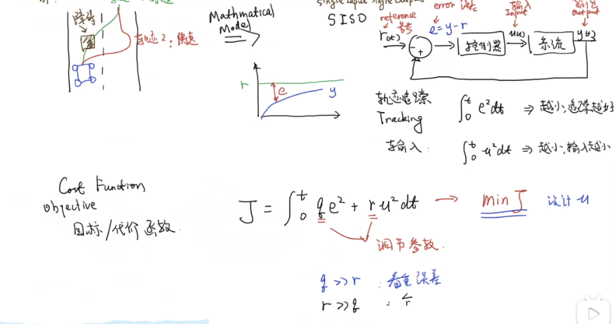

#### 研究动机(Motivation)
在约束条件下下达到最优的系统表现
### core concept
- 最优控制的核心问题是构造一个代价函数， 然后针对这个代价函数进行优化， 从而使得代价函数最小， 满足我们的期望(平均误差最小或者能量损耗最小， 或者平滑性最好)

- 最优控制主要有两个步骤: 
	1. 根据传递函数/状态转移方程构造代价函数
	2. 代价函数转换为`QP`问题求解(凸优化)
### 一个简单的例子
