## Core concepts
强化学习的本质是一种最优控制算法。(这么说好像也不对， 因为强化学习是一个更加泛化的框架)
- state 状态(S 状态空间)
- action 动作(A 动作空间)
- reward 奖励(R 奖励空间)
- policy 策略(π 策略空间), 以条件概率进行表达
- value function 价值函数(V 状态价值函数)
- trajectory 轨迹
- episode 回合
- return 回报(对应优化控制中的目标函数Cost)
- bootstrap 递归
### 经典框架
与最优控制的控制框架有惊人的相似性:

### 马尔科夫过程(Markov Process)
#### 马尔科夫性(Markov Property)
马尔科夫性(Markov Property)是马尔科夫过程的最基本特征， 它表示系统的未来状态只依赖于当前状态， 而与过去状态无关。

## 贝尔曼方程
### state-value(cost-to-go)
定义的是从当前状态出发， 到达终止状态的期望奖励(期望代价)
### 贝尔曼公式(Bellman equation)
#### Bellman Equation(deterministic): 
$$
\begin{equation}
\begin{aligned}
v &= r + \gamma P v \\
V_\pi(s) &= \mathbb{E}[R_{t+1} + \gamma V_\pi(S_{t+1}) | S_t = s] \\
\end{aligned}
\end{equation}
\tag{1.1}
$$
> 多条状态轨迹的加权平均值

#### Bellman Equation(stochastic): 
考虑如下state trajectory:
$$
\begin{equation}
\begin{aligned}
S_T \mathop{\rightarrow}\limits^{A_t} R_{t+1},S_{t+1} \mathop{\rightarrow}\limits^{A_{t+1}} \cdots 
\end{aligned}
\end{equation}
\tag{1.2}
$$
计算$G_t$(discounted return):
$$
\begin{equation}
\begin{aligned}
G_t &= R_{t+1} + \gamma R_{t+2} + \gamma^2 R_{t+3} + \cdots \\
&= R_{t+1} + \gamma(R_{t+2} + \gamma R_{t+3} + \cdots) \\
&= R_{t+1} + \gamma G_{t+1} \\
\end{aligned}
\end{equation}
\tag{1.3}
$$
定义当前状态价值函数(state-value function):
$$
\begin{equation}
\begin{aligned}
v_\pi(s) &= \mathbb{E}[G_t | S_t = s] \\
&= \mathbb{E}[R_{t+1} + \gamma G_{t+1} | S_t = s] \\
&= \mathbb{E}[R_{t+1} | S_t = s] + \gamma \mathbb{E}[G_{t+1} | S_t = s] \\
\end{aligned}
\end{equation}
\tag{1.4}
$$
然后我们将上面的式子第一项展开(应用全概率公式):
$$
\begin{equation}
\begin{aligned}
\mathbb{E}[R_t | S_t = s] &= \sum_{a \in A} \pi(a | s) \mathbb{E}[R_{t+1} | S_t = s, A_t = a]\\
&= \sum_{a \in A} \pi(a | s) \sum_{r \in R} p(r|s, a)r \\
\end{aligned}
\end{equation}
\tag{1.5}
$$
然后我们将上面的式子第二项展开:
$$
\begin{equation}
\begin{aligned}
\mathbb{E}[G_t | S_t = s] &= \sum_{s' \in S} \mathbb{E}[G_{t+1} | S_t = s, S_{t+1}=s']p(s'|s)\\
&=\sum_{s' \in S} \mathbb{E}[G_{t+1} | S_{t+1} = s']p(s'|s)\\
&= \sum_{s' \in S} v_{\pi}(s')p(s'|s)\\
&= \sum_{s' \in S} v_{\pi}(s')\sum_{a \in A} \pi(a | s)p(s'|s, a)\\
\end{aligned}
\end{equation}
\tag{1.6}
$$
于是有贝尔曼公式的完全展开形式:
$$
\begin{equation}
\begin{aligned}
V_\pi(s) &= \sum_{a \in A} \pi(a | s) \mathbb{E}[R_{t+1} | S_t = s, A_t = a] + \gamma \sum_{s' \in S} \mathbb{E}[G_{t+1} | S_t = s, S_{t+1}=s']p(s'|s)\\
&= \sum_{a \in A} \pi(a | s) \sum_{r \in R} p(r|s, a)r + \gamma \sum_{s' \in S} v_{\pi}(s')\sum_{a \in A} \pi(a | s)p(s'|s, a)\\
&= \sum_{a \in A} \pi(a | s) \sum_{r \in R} p(r|s, a)r + \gamma \sum_{s' \in S} \sum_{a \in A} \pi(a | s)p(s'|s, a)v_{\pi}(s')\\
&= \sum_{a \in A} \pi(a | s) \sum_{r \in R} p(r|s, a)r + \gamma \sum_{a \in A} \pi(a | s)\sum_{s' \in S} p(s'|s, a)v_{\pi}(s')\\
&= \sum_{a \in A} \pi(a | s)[\sum_{r \in R} p(r|s, a)r + \gamma \sum_{s' \in S} p(s'|s, a)v_{\pi}(s')]
\end{aligned}
\end{equation}
\tag{1.7}
$$
> $\pi(a | s)$是给出的策略， 代表在状态$s$下选择动作$a$的概率
> $p(s'|s, a)$是状态转移概率(也即对象模型)， 代表在状态$s$下选择动作$a$后转移到状态$s'$的概率
#### 贝尔曼公式(矩阵-向量形式)
将式1.7整理为如下形式:
$$
\begin{equation}
\begin{aligned}
V_\pi(s) &= r_{\pi}(s) + \gamma \sum_{s' \in S} p_{\pi}(s'|s)v_{\pi}(s')\\
\end{aligned}
\end{equation}
\tag{1.8}
$$
其中，
$$
\begin{equation}
\begin{aligned}
r_{\pi}(s) &= \sum_{a \in A} \pi(a | s) \sum_{r \in R} p(r|s, a)r \\
p_{\pi}(s'|s) &= \sum_{a \in A} \pi(a | s)p(s'|s, a)
\end{aligned}
\end{equation}
\tag{1.9}
$$
然后将式1.9的下标形式写出来(方便后面整理为矩阵形式):
$$
\begin{equation}
\begin{aligned}
v_{\pi}(s_i)=r_{\pi}(s_i)+\gamma \sum_{s_j \in S} p_{\pi}(s_j | s_i)v_{\pi}(s_j)
\end{aligned}
\end{equation}
\tag{1.10}
$$
然后将所有的$s_i$写为矩阵-向量形式:
$$
\begin{equation}
\begin{aligned}
V_\pi &= r_\pi + \gamma P_{\pi} V_\pi \\
\end{aligned}
\end{equation}
\tag{1.11}
$$
其中，
$$
\begin{equation}
\begin{aligned}
V_{\pi} &= [v_{\pi}(s_1), v_{\pi}(s_2), \cdots, v_{\pi}(s_n)]^T\\
r_{\pi} &= [r_{\pi}(s_1), r_{\pi}(s_2), \cdots, r_{\pi}(s_n)]^T\\
P_{\pi} &\in \mathbb{R}^{n \times n}, [P_{\pi}]_{ij} = p_{\pi}(s_j | s_i), 称为状态转移矩阵
\end{aligned}
\end{equation}
\tag{1.12}
$$
### 贝尔曼公式的求解
#### 解析形式(close-form solution)
对式1.11进行解析求解， 有:
$$
\begin{equation}
\begin{aligned}
V_\pi &= (I - \gamma P_\pi)^{-1} r_\pi
\end{aligned}
\end{equation}
\tag{1.13}
$$
但是这种求解形式需要求逆， 计算代价较大， 一般不使用。
#### 迭代形式(iterative form)
$$
\begin{equation}
\begin{aligned}
V_{\pi}^{(k+1)} &= r_\pi + \gamma P_\pi V_{\pi}^{(k)}
\end{aligned}
\end{equation}
\tag{1.14}
$$
> 可以证明，当k->$\infty$时， $V_{\pi}^{(k)}$收敛到$V_{\pi}$。

证明如下图:

> 计算state value是为了评判策略的好坏， 进而迭代更好的策略。这个过程便称之为**policy evaluation**

### action value
action value指的是从某个state出发并且采取了某个action之后得到的average return. action value用来选择比较最佳action.
定义:
$$
\begin{equation}
\begin{aligned}
\begin{matrix}\underbrace{q_\pi(s, a)} \\ v_{\pi}(s) \end{matrix} &= \sum_{a \in A}\begin{matrix}\underbrace{\mathbb{E}[G_t | S_t = s, A_t = a]} \\ q_{\pi}(s, a) \end{matrix} \pi(a|s) \\
\end{aligned}
\end{equation}
\tag{1.15}
$$
又由于
$$
\begin{equation}
\begin{aligned}
\mathbb{E}[G_t | S_t = s] &= \mathbb{E}[G_t| S_t = s, A_t = a] \pi(a, s) \\
\end{aligned}
\end{equation}
\tag{1.16}
$$
故有:
$$
\begin{equation}
\begin{aligned}
v_{\pi}(s) &= \sum_{a \in A} \pi(a | s) q_{\pi}(s, a) \\
\end{aligned}
\end{equation}
\tag{1.17}
$$
又由式1.7
$$
\begin{equation}
\begin{aligned}
V_\pi(s) &= \sum_{a \in A} \pi(a | s)\begin{matrix}\underbrace{\sum_{r \in R} p(r|s, a)r + \gamma \sum_{s' \in S} p(s'|s, a)v_{\pi}(s')}\\ q_{\pi}(s, a) \end{matrix}
\end{aligned}
\end{equation}
\tag{1.18}
$$
故，
$$
\begin{equation}
\begin{aligned}
q_{\pi}(s, a) &= \sum_{r \in R} p(r|s, a)r + \gamma \sum_{s' \in S} p(s'|s, a)v_{\pi}(s') \\
\end{aligned}
\end{equation}
\tag{1.19}
$$
## 贝尔曼最优方程Bellman optimality equation(BOE)
### core concepts
#### optimal state value

#### optimal policy
##### 定义
A policy is optimal $\pi^*$ if $V_{\pi^*}(s) = V'(s)$ for all $s \in S$
> 贝尔曼最优方程用来求解optimal policy

##### Bellman optimality equation(intro)
$$
\begin{equation}
\begin{aligned}
v^*(s) &= \max_{\pi} \sum_{a \in A} \pi(a | s) q(s, a) \\
q(s, a) &= \sum_{r \in R} p(r|s, a)r + \gamma \sum_{s' \in S} p(s'|s, a)v(s')
\end{aligned}
\end{equation}
\tag{1.20}
$$
##### Bellman optimality equation(matrix form)
$$
\begin{equation}
\begin{aligned}
v^* &= \max_{\pi} (r_\pi + \gamma P_\pi v) \\
\end{aligned}
\end{equation}
\tag{1.21}
$$
式1.21的求解说明:
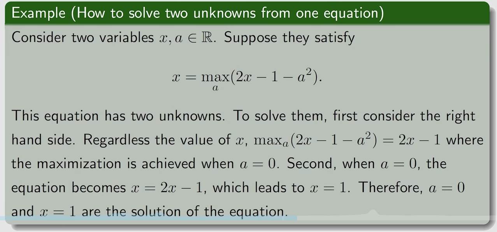
按照上面例子的启发， 我们可以暂时把$v(s')$看做一个已知量，然后得到$\pi^*(s)$的形式表达式， 再看一个例子:
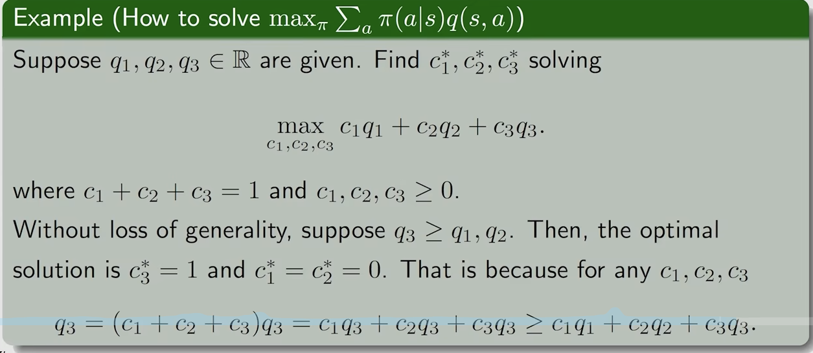
> 那岂不是最优策略都是确定性的了?

故， 

$$ 
\begin{equation}
\begin{aligned}
\mathop{max}\limits_{\pi} \sum_{a \in A} \pi(a | s) q(s, a) = \mathop{max}\limits_{a \in A} q(s, a)
\end{aligned}
\end{equation}
\tag{1.22}
$$
其中最优策略为:
$$
\begin{equation}
\begin{aligned}
\pi(a|s) &= \left\{ \begin{matrix} 1 & \text{if } a = \arg\max_{a \in A} q(s, a) \\ 0 & \text{otherwise} \end{matrix} \right. \\
\end{aligned}
\end{equation}
\tag{1.23}
$$
$\pi^*$已经求得， 接下来求解$v(s)$
令
$$
\begin{equation}
\begin{aligned}
f(v) := \mathop{max}\limits_{\pi} (r_\pi + \gamma P_\pi v)
\end{aligned}
\end{equation}
\tag{1.24}
$$
那么贝尔曼最优公式变为:
$$
\begin{equation}
\begin{aligned}
v = f(v)
\end{aligned}
\end{equation}
\tag{1.25}
$$
##### Contraction mapping theorem
- fix point:x $\in$ X is a fixed point of f: X -> X if $f(x) = x$
- contraction mapping: 
$$
\begin{equation}
\begin{aligned}
\|f(x) - f(y)\| \leq \alpha \|x - y\|
\end{aligned}
\end{equation}
\tag{1.26}
$$
其中$\alpha \in [0, 1)$, $\|\cdot\|$是向量范数
> 有点李雅普诺夫函数的感觉

- contraction mapping theorem: 
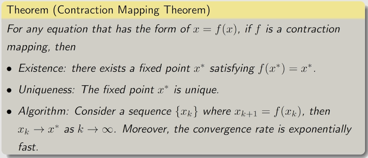

> 看到这个定理， 有点理解状态方程为啥那么写了
##### Contraction property of BOE
对于式1.25中定义的$f(v)$, 可以证明其具有收缩性, 证明见**强化学习的数学原理**这本书(多少页).
于是可以从任意给定初值$v_0$, 通过迭代
$$
\begin{equation}
\begin{aligned}
v_{k+1} &= f(v_k) \\
v^* &= \lim_{k \to \infty} v_k
\end{aligned}
\end{equation}
\tag{1.27}
$$
得到最优状态值$v^*$, 也可以写为如下形式:
$$
\begin{equation}
\begin{aligned}
v^* &= \mathop{max}\limits_{max} (r_\pi + \gamma P_\pi v^*) \\
\end{aligned}
\end{equation}
\tag{1.28}
$$
对于给定的$v^*$, 可以求得:
$$
\begin{equation}
\begin{aligned}
\pi^*(s) &= \arg\max_{\pi} (r_\pi + \gamma P_\pi v^*)\\
\end{aligned}
\end{equation}
\tag{1.29}
$$
再将式1.29代入式1.28, 得到最优策略对应的贝尔曼公式:
$$
\begin{equation}
\begin{aligned}
v^* &= r_{\pi^*} + \gamma P_{\pi^*} v^* \\
\end{aligned}
\end{equation}
\tag{1.30}
$$
其中$\pi^*$的最优性命题如下(证明见书本1):
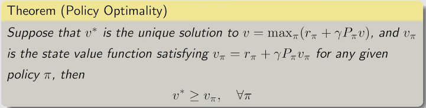
 
##### 最优策略的形式
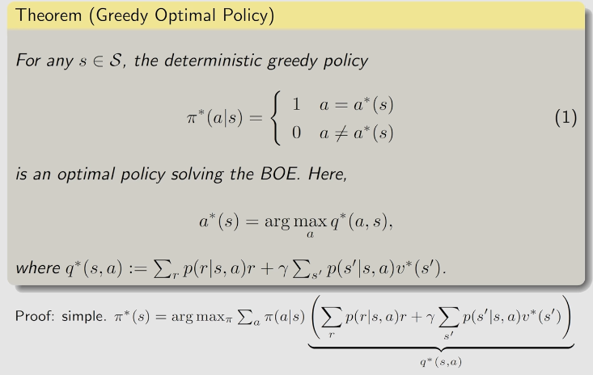

> TODO: 实现网格的例子

## Value Iteration && Policy Iteration
### Value Iteration
式1.27便是值迭代算法。可以展开写为如下形式:
$$
\begin{equation}
\begin{aligned}
v_{k+1} &= f(v_k)=\mathop{max}\limits_{\pi} (r_\pi + \gamma P_\pi v_k)\\
\end{aligned}
\end{equation}
\tag{2.1}
$$
在实际的计算中， 可以分为两步:
- step 1: policy update
$$
\begin{equation}
\begin{aligned}
\pi_{k+1}(s) &= \arg\max_{\pi} (r_\pi + \gamma P_\pi v_k)\\
\end{aligned}
\end{equation}
\tag{2.2}
$$
- step 2: value update
$$
\begin{equation}
\begin{aligned}
v_{k+1} &= r_{\pi_{k+1}} + \gamma P_{\pi_{k+1}} v_k\\
\end{aligned}
\end{equation}
\tag{2.3}
$$

> 思考: 这个与EM算法的关系, 式2.2即为EM的M-step

以element-wise来说明算法具体是如何实施的: 
- step 1: policy update
式2.2的element-wise形式为:
$$
\begin{equation}
\begin{aligned}
\pi_{k+1}(s) &= \arg\max_{\pi} \sum_{a \in A} \pi(a | s) (\sum_r p(r|s, a)r + \gamma \sum_{s' \in S} p(s'|s, a)v_k(s')), s \in S\\
\end{aligned}
\end{equation}
\tag{2.4}
$$
其中第k+1步的最优策略为:
$$
\begin{equation}
\begin{aligned}
\pi_{k+1}(s) &= \left\{ \begin{matrix} 1 & \text{if } a = a^*_k(s) \\ 0 & \text{otherwise} \end{matrix} \right.\\
\end{aligned}
\end{equation}
\tag{2.5}
$$
其中$a^*_k(s)=\mathop{argmax}\limits_{a \in A} q_k(s, a)$, 称为贪婪策略.
- step 2: value update
式2.3的element-wise形式为:
$$
\begin{equation}
\begin{aligned}
v_{k+1}(s) &= \sum_{a \in A} \pi_{k+1}(s, a) (\sum_r p(r|s, a)r + \gamma \sum_{s' \in S} p(s'|s, a)v_k(s'))\\
\end{aligned}
\end{equation}
\tag{2.6}
$$
> 式2.6与式2.5是一样的， 只是已知量、未知量不同

完整算法流程如下:
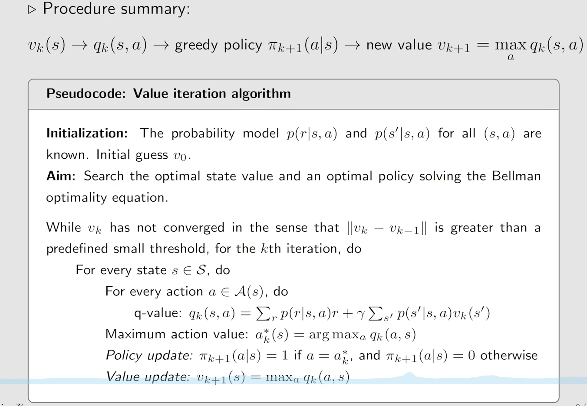
> 这个过程与动态规划的过程非常相似， 也有深刻的内在联系

> state iteration是从一个初始状态出发， 通过迭代更新状态值， 直到状态值收敛到最优状态值$v^*$, 与此同时， 策略也随之更新到最优策略$\pi^*$, 本质上式通过迭代的方式求解贝尔曼最优方程。
### Policy Iteration
策略更新从一个初始的猜测策略开始$\pi_0$, 然后通过迭代更新策略， 直到策略收敛到最优策略$\pi^*$， 与值迭代的区别是在利用式1.30的结论， 求出一个策略对应的状态价值， 然后再基于这个**最优**的状态价值， 更新策略， 直到策略收敛到最优策略$\pi^*$。
#### 算法框架
- step1: policy evaluation
$$
\begin{equation}
\begin{aligned}
v_{\pi_{k}} &= r_{\pi_{k}} + \gamma P_{\pi_{k}} v_{\pi_k}\\
\end{aligned}
\end{equation}
\tag{2.7}
$$
> 其中$v_{\pi_k}$是状态价值函数, 式2.7通过迭代的方式进行求解
- step2: policy improvement
$$
\begin{equation}
\begin{aligned}
\pi_{k+1} &= \arg\max_{\pi} (r_{\pi_k} + \gamma P_{\pi_k} v_{\pi_k})\\
\end{aligned}
\end{equation}
\tag{2.8}
$$
式2.8中，$\pi_{k+1}$比$\pi_k$更优, 是通过如下定理得到保证的:
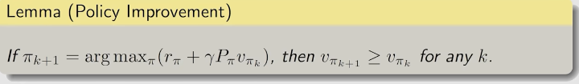
每次迭代策略的过程中， 我们知道:
$$
v_{\pi_0} \leq v_{\pi_1} \leq v_{\pi_2} \leq \cdots \leq v_{\pi_k} \leq \cdots \leq v^*
$$
那么$k\rightarrow\infty$的时候, $v_{\pi_k}\rightarrow v^*$由如下定理保证: 
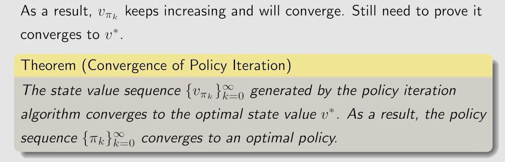
#### Elements Policy iteration 算法流程
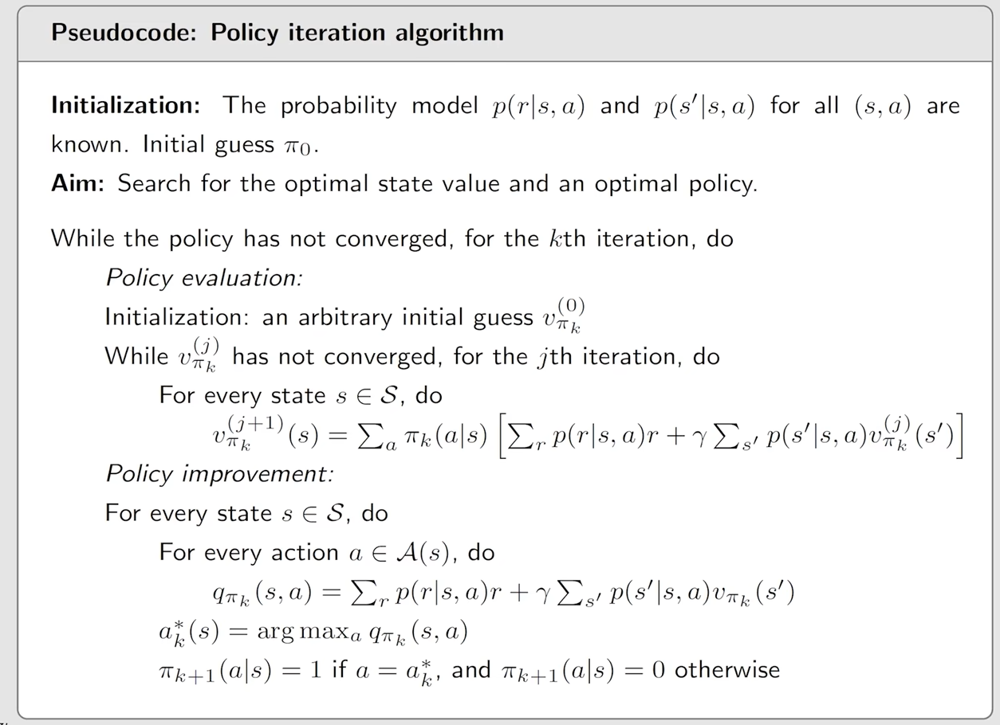

### truncated policy iteration
Policy Iteration 和 Value Iteration 是truncated policy iteration的两种极端情况。
truncated policy iteration的idea在于， 当们在评估策略的时候， Value Iteration只迭代了一步， 而Policy Iteration则迭代到了v^*, 而truncated policy iteration则介于两者之间(k步后的迭代被截断了, 那么k如何截断呢)。如下图所示:
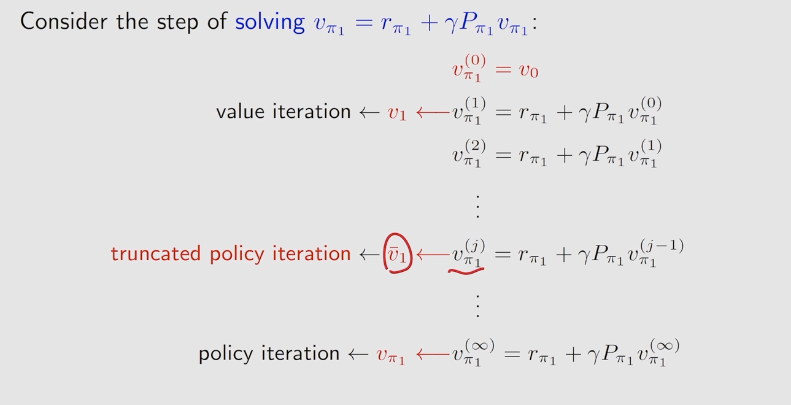
在实际应用中， policy iteration与value iterations是等价的， 因为我们不会真的迭代无限多步。
> truncated policy在收敛速度与精度上取得平衡。

## 蒙特卡洛强化学习(model-free)
### Monte Carlo estimation
一个例子:
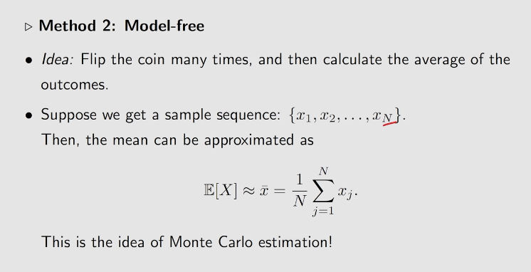
> 上面这个例子也是频率->概率的思想， 遵循大数定律

### MC basic
式1.15是不基于模型的。具体实施流程:
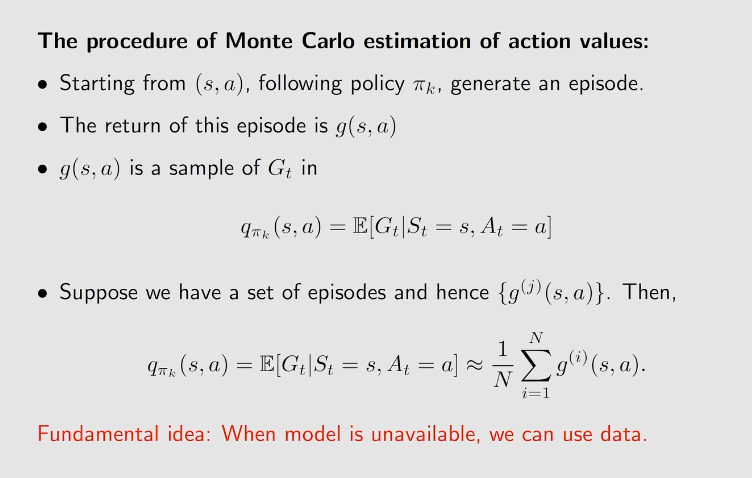
> 使用采样数据进行动作价值函数的求解。

伪代码如下:
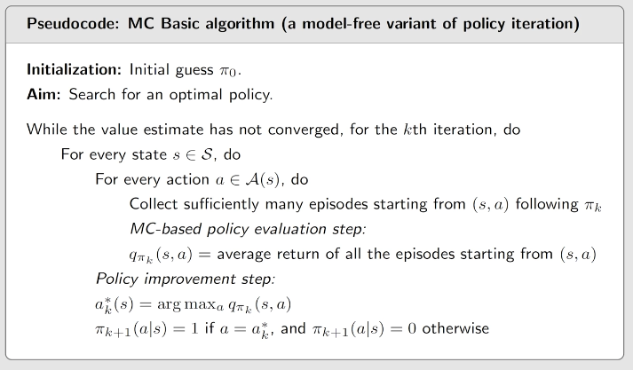

> the impact of episode length on MC basic, 短视vs长视
### MC exploring starts算法
> 动机是提高数据的利用效率以及计算效率
- action pair(s, a)
对应了一个动作价值函数$q(s, a)$, 在计算$E[G_t|s_t=s, a_t=a]$的时候， 很多中间步骤是重复计算的: 

- visit
每次进入一个action pair叫做一次visitl。
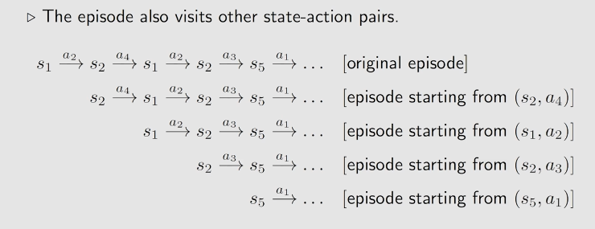
> 这里即提升了数据的利用率

- generalized policy iteration(GPI)
进一步， 使用仅一条episode来估计动作价值，以提升计算效率.
最终得到的算法流程如下:
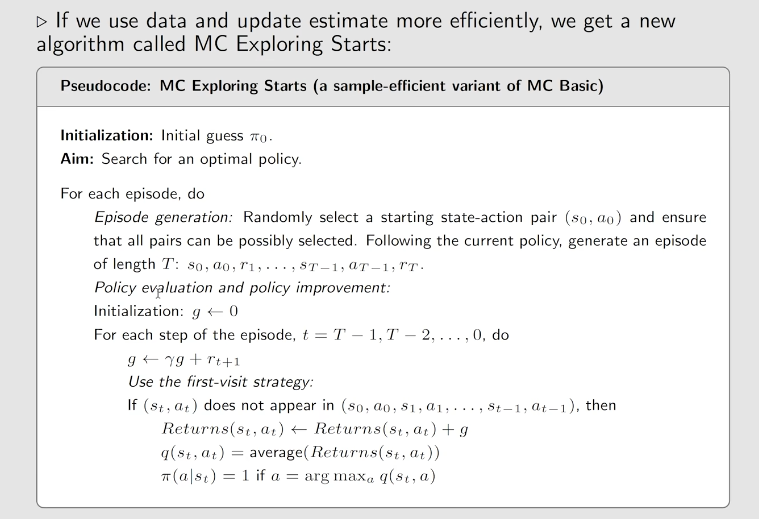
> 实际收敛性放松了, 上面算法可应用递归尾部问题的思想来实现。explore指的是对单个s的的A进行探索， starts指的是从当前s出发(start)[替代方法是从其他状态出发， 经过(visit)当前状态的时候就计算出来了]

### MC without exploring starts
#### soft policy
**definition:** A policy is called soft if the probality to take any action is positive.

$\epsilon$-greedy policy, 如下:
$$
\begin{equation}
\begin{aligned}
\pi(a|s) = \left\{ \begin{matrix} 1-\epsilon + \frac{\epsilon}{|A|} & \text{if } a = a^* \\ \frac{\epsilon}{|A|} & \text{otherwise} \end{matrix} \right.
\end{aligned}
\end{equation}
\tag{3.1}
$$
>  $\epsilon$-greedy policy 在平衡exploitation(充分利用率)和exploration(探索覆盖性)上起到了重要作用
#### MC based RL algorithm
- policy improvement
$$
\begin{equation}
\begin{aligned}
\pi_{k+1}(s) &= \argmax_{\pi \in \Pi_\epsilon} (\sum_a \pi(a|s)q_{\pi_k}(s, a))\\
\end{aligned}
\end{equation}
\tag{3.2}
$$
最优策略为:
$$
\begin{equation}
\begin{aligned}
\pi_{k+1}(a|s) = \left\{ \begin{matrix} 1-\epsilon + \frac{\epsilon}{|A|} & \text{if } a = a^* \\ \frac{\epsilon}{|A|} & \text{otherwise} \end{matrix} \right.
\end{aligned}
\end{equation}
\tag{3.3}
$$
算法流程如下:
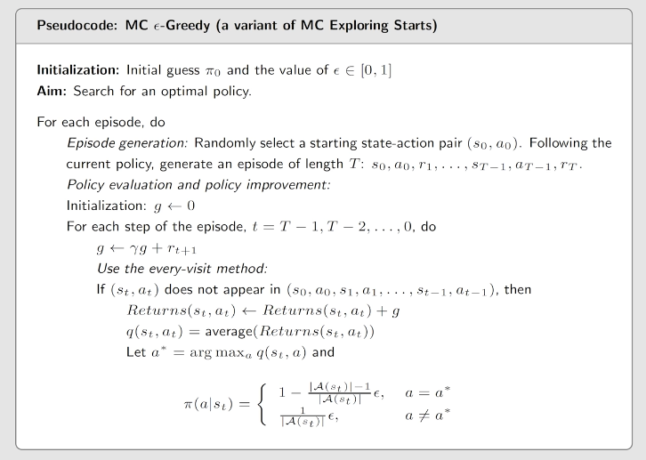

## 时序差分方法(TD learning)

> 原始的td method是用来求state value的
### Motivation example
#### 问题定义- 均值估计
##### 问题一
$$
\begin{equation}
\begin{aligned}
w = \mathbb{E}[v(X)]\\
\end{aligned}
\end{equation}
\tag{1.1}
$$
其中{x}是X随机变量的iid的采样
##### 问题2
$$
\begin{equation}
\begin{aligned}
w = \mathbb{E}[R + \gamma v(X)]
\end{aligned}
\end{equation}
\tag{1.2}
$$
### TD learning of state value
> 目的: state value的估计, 并用state value来做policy evaluation
给定策略:$\pi(s_0, r_1, s_1,\cdots, s_t, r_{t+1}, s_{t+1},\cdots)=\pi(\{s_t, r_{t+1}, s_{t+1}\})$

#### TD learning algorithm(what)
$$
\begin{equation}
\begin{aligned}
\begin{matrix}\\ \underbrace{v_{t+1}(s_t)} \\ new \space estimate\end{matrix}&=\begin{matrix}\\ \underbrace{v_t(s_t)} \\ current \space estimate\end{matrix}-\alpha_t(s_t)[\begin{matrix}TD \space error \space \delta_t \\ \overbrace{v_t(s_t)-\underbrace{[r_{t+1}+\gamma v_{t}(s_{t+1})}]} \\ \qquad TD \space target \space \overline{v}_t\end{matrix}] \\
v_{t+1}(s)&=v_t(s) , \forall s \not= s_t
\end{aligned}
\end{equation}
\tag{4.1}
$$
其中$t=0, 1, 2, \cdots$, $v_t(s_t)$是$v_\pi(s_t)$的估计值, $\alpha_t(s_t)$是学习率 
##### TD target
> 式4.1中算法会让$v_t(s_t)$越来越接近于$\overline{v}_t$

说明如下:
$$
\begin{equation}
\begin{aligned}
v_{t+1}(s_t) &= v_t(s_t)-\alpha_t(s_t)[v_t(s_t)-\overline{v}_t] \\
\Rightarrow v_{t+1}(s_t) - \overline{v}_t &= v_t(s_t) - \overline{v}_t - \alpha_t(s_t)[v_t(s_t) - \overline{v}_t] \\
\Rightarrow v_{t+1}(s_t) - \overline{v}_t &= (1-\alpha_t(s_t))(v_t(s_t) - \overline{v}_t) \\
\Rightarrow |v_{t+1}(s_t) - \overline{v}_t| &= |(1-\alpha_t(s_t))||(v_t(s_t) - \overline{v}_t)| \\
since & \quad |1-\alpha_t(s_t)|<1, \\
\Rightarrow |v_{t+1}(s_t) - \overline{v}_t| &= |(v_t(s_t) - \overline{v}_t)| \\
\end{aligned}
\end{equation}
\tag{4.2}
$$
##### TD error
$$
\begin{equation}
\begin{aligned}
\delta_t &= v_t(s_t)-[r_{t+1}+\gamma v_{t}(s_{t+1})] \\
\end{aligned}
\end{equation}
\tag{4.3}
$$
- TD error是两个时刻的差分
- TD error衡量了$v_t$与$v_\pi$的距离
- TD error是对state value的估计误差
如果我们把$v_\pi$带入式4.2， 就得到了:
$$
\begin{equation}
\begin{aligned}
\delta_{\pi, t} &= v_\pi(s_t)-[r_{t+1}+\gamma v_{\pi}(s_{t+1})] \\
\end{aligned}
\end{equation}
\tag{4.4}
$$
对上式子求期望:
$$
\begin{equation}
\begin{aligned}
\mathbb{E}[\delta_{\pi, t}|S_t = s_t] &= v_\pi(s_t)-\mathbb{E}[R_{t+1}+\gamma v_{\pi}(S_{t+1})|S_t = s_t] = 0 \\
\end{aligned}
\end{equation}
\tag{4.5}
$$
##### TD算法的设计
> TD method是在没有模型的情况下求解贝尔曼方程

state value of $\pi$ is:
$$
\begin{equation}
\begin{aligned}
v_\pi(s) &= \mathbb{E}[R + \gamma G|S = s], s \in S\\
\end{aligned}
\end{equation}
\tag{4.6}
$$
又知道:
$$
\begin{equation}
\begin{aligned}
\mathbb{E}[G|S = s] &= \sum_{a \in A} \pi(a|s)\sum{p(s'|s, a)v_\pi(s')} = \mathbb{E}[v_\pi(S')|S = s]\\
\end{aligned}
\end{equation}
\tag{4.7}
$$
代入式4.6， 得到:
$$
\begin{equation}
\begin{aligned}
v_\pi(s) &= \mathbb{E}[R + \gamma v_\pi(S')|S = s]\\
\end{aligned}
\end{equation}
\tag{4.8}
$$
是4.8即为贝尔曼期望方程。我们的时序差分方法就是在无模型的情况下求解该方程中的$v_\pi(s)$

##### 从RM算法框架看TD算法及其收敛性
令$g(v_\pi(s)) = v_\pi(s)-\mathbb{E}[R + \gamma v_\pi(S')|S = s] = 0$, 则应用RM算法, 其迭代收敛解为:
$$
\begin{equation}
\begin{aligned}
v_\pi(s)^{k+1}&= v_\pi(s)^k - \alpha_k(\widetilde{g}(v_\pi(s)^k))\\
&= v_\pi(s)^k - \alpha_k(v_\pi(s)^k-[r_{t+1} + \gamma v_\pi(s')])\\
\end{aligned}
\end{equation}
\tag{4.9}
$$
其中， 
$$
\begin{equation}
\begin{aligned}
\widetilde{g}(v_\pi(s)^k) &= v_\pi(s)^k-[r_{t+1} + \gamma v_\pi(s')] \\
&=\begin{matrix} \underbrace{v_\pi(s)-\mathbb{E}[R + \gamma v_\pi(S')|S = s]}\\ g(v_\pi(s))\end{matrix} + \begin{matrix} \underbrace{\mathbb{E}[R + \gamma v_\pi(S')|S = s]- [r_{t+1} + \gamma v_\pi(s')] }\\ 测量误差\eta \end{matrix}\\
\end{aligned}
\end{equation}
\tag{4.10}
$$
> 我们需要有(s, r, s')的数据, 在TD算法中修改为了(s_t, r_{t+1}, s_{t+1})
> $v_\pi(s')$使用$v_t(s')$来代替

