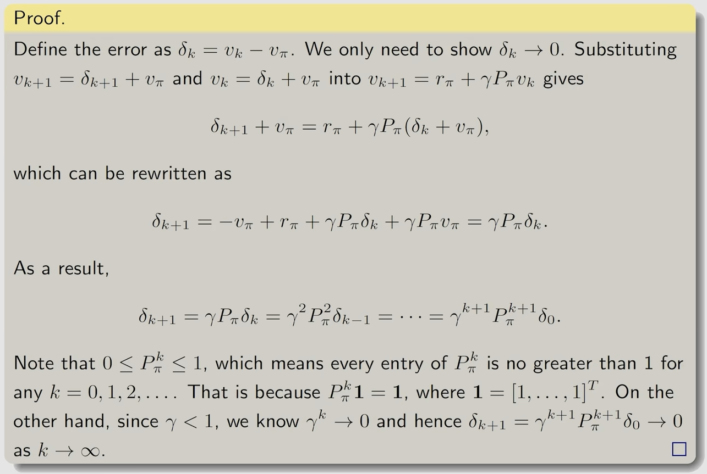

## Core concepts
强化学习的本质是一种最优控制算法。(这么说好像也不对， 因为强化学习是一个更加泛化的框架)
- state 状态(S 状态空间)
- action 动作(A 动作空间)
- reward 奖励(R 奖励空间)
- policy 策略(π 策略空间), 以条件概率进行表达
- value function 价值函数(V 状态价值函数)
- trajectory 轨迹
- episode 回合
- return 回报(对应优化控制中的目标函数Cost)
- bootstrap 递归
### 经典框架
与最优控制的控制框架有惊人的相似性:

### 马尔科夫过程(Markov Process)
#### 马尔科夫性(Markov Property)
马尔科夫性(Markov Property)是马尔科夫过程的最基本特征， 它表示系统的未来状态只依赖于当前状态， 而与过去状态无关。

## 贝尔曼方程
### state-value(cost-to-go)
定义的是从当前状态出发， 到达终止状态的期望奖励(期望代价)
### 贝尔曼公式(Bellman equation)
#### Bellman Equation(deterministic): 
$$
\begin{equation}
\begin{aligned}
v &= r + \gamma P v \\
V_\pi(s) &= \mathbb{E}[R_{t+1} + \gamma V_\pi(S_{t+1}) | S_t = s] \\
\end{aligned}
\end{equation}
\tag{1.1}
$$
> 多条状态轨迹的加权平均值

#### Bellman Equation(stochastic): 
考虑如下state trajectory:
$$
\begin{equation}
\begin{aligned}
S_T \mathop{\rightarrow}\limits^{A_t} R_{t+1},S_{t+1} \mathop{\rightarrow}\limits^{A_{t+1}} \cdots 
\end{aligned}
\end{equation}
\tag{1.2}
$$
计算$G_t$(discounted return):
$$
\begin{equation}
\begin{aligned}
G_t &= R_{t+1} + \gamma R_{t+2} + \gamma^2 R_{t+3} + \cdots \\
&= R_{t+1} + \gamma(R_{t+2} + \gamma R_{t+3} + \cdots) \\
&= R_{t+1} + \gamma G_{t+1} \\
\end{aligned}
\end{equation}
\tag{1.3}
$$
定义当前状态价值函数(state-value function):
$$
\begin{equation}
\begin{aligned}
V_\pi(s) &= \mathbb{E}[G_t | S_t = s] \\
&= \mathbb{E}[R_{t+1} + \gamma G_{t+1} | S_t = s] \\
&= \mathbb{E}[R_{t+1} | S_t = s] + \gamma \mathbb{E}[G_{t+1} | S_t = s] \\
\end{aligned}
\end{equation}
\tag{1.4}
$$
然后我们将上面的式子第一项展开(应用全概率公式):
$$
\begin{equation}
\begin{aligned}
\mathbb{E}[R_t | S_t = s] &= \sum_{a \in A} \pi(a | s) \mathbb{E}[R_{t+1} | S_t = s, A_t = a]\\
&= \sum_{a \in A} \pi(a | s) \sum_{r \in R} p(r|s, a)r \\
\end{aligned}
\end{equation}
\tag{1.5}
$$
然后我们将上面的式子第二项展开:
$$
\begin{equation}
\begin{aligned}
\mathbb{E}[G_t | S_t = s] &= \sum_{s' \in S} \mathbb{E}[G_{t+1} | S_t = s, S_{t+1}=s']p(s'|s)\\
&=\sum_{s' \in S} \mathbb{E}[G_{t+1} | S_{t+1} = s']p(s'|s)\\
&= \sum_{s' \in S} v_{\pi}(s')p(s'|s)\\
&= \sum_{s' \in S} v_{\pi}(s')\sum_{a \in A} \pi(a | s)p(s'|s, a)\\
\end{aligned}
\end{equation}
\tag{1.6}
$$
于是有贝尔曼公式的完全展开形式:
$$
\begin{equation}
\begin{aligned}
V_\pi(s) &= \sum_{a \in A} \pi(a | s) \mathbb{E}[R_{t+1} | S_t = s, A_t = a] + \gamma \sum_{s' \in S} \mathbb{E}[G_{t+1} | S_t = s, S_{t+1}=s']p(s'|s)\\
&= \sum_{a \in A} \pi(a | s) \sum_{r \in R} p(r|s, a)r + \gamma \sum_{s' \in S} v_{\pi}(s')\sum_{a \in A} \pi(a | s)p(s'|s, a)\\
&= \sum_{a \in A} \pi(a | s) \sum_{r \in R} p(r|s, a)r + \gamma \sum_{s' \in S} \sum_{a \in A} \pi(a | s)p(s'|s, a)v_{\pi}(s')\\
&= \sum_{a \in A} \pi(a | s) \sum_{r \in R} p(r|s, a)r + \gamma \sum_{a \in A} \pi(a | s)\sum_{s' \in S} p(s'|s, a)v_{\pi}(s')\\
&= \sum_{a \in A} \pi(a | s)[\sum_{r \in R} p(r|s, a)r + \gamma \sum_{s' \in S} p(s'|s, a)v_{\pi}(s')]
\end{aligned}
\end{equation}
\tag{1.7}
$$
> $\pi(a | s)$是给出的策略， 代表在状态$s$下选择动作$a$的概率
> $p(s'|s, a)$是状态转移概率(也即对象模型)， 代表在状态$s$下选择动作$a$后转移到状态$s'$的概率
#### 贝尔曼公式(矩阵-向量形式)
将式1.7整理为如下形式:
$$
\begin{equation}
\begin{aligned}
V_\pi(s) &= r_{\pi}(s) + \gamma \sum_{s' \in S} p_{\pi}(s'|s)v_{\pi}(s')\\
\end{aligned}
\end{equation}
\tag{1.8}
$$
其中，
$$
\begin{equation}
\begin{aligned}
r_{\pi}(s) &= \sum_{a \in A} \pi(a | s) \sum_{r \in R} p(r|s, a)r \\
p_{\pi}(s'|s) &= \sum_{a \in A} \pi(a | s)p(s'|s, a)
\end{aligned}
\end{equation}
\tag{1.9}
$$
然后将式1.9的下标形式写出来(方便后面整理为矩阵形式):
$$
\begin{equation}
\begin{aligned}
v_{\pi}(s_i)=r_{\pi}(s_i)+\gamma \sum_{s_j \in S} p_{\pi}(s_j | s_i)v_{\pi}(s_j)
\end{aligned}
\end{equation}
\tag{1.10}
$$
然后将所有的$s_i$写为矩阵-向量形式:
$$
\begin{equation}
\begin{aligned}
V_\pi &= r_\pi + \gamma P_{\pi} V_\pi \\
\end{aligned}
\end{equation}
\tag{1.11}
$$
其中，
$$
\begin{equation}
\begin{aligned}
V_{\pi} &= [v_{\pi}(s_1), v_{\pi}(s_2), \cdots, v_{\pi}(s_n)]^T\\
r_{\pi} &= [r_{\pi}(s_1), r_{\pi}(s_2), \cdots, r_{\pi}(s_n)]^T\\
P_{\pi} &\in \mathbb{R}^{n \times n}, [P_{\pi}]_{ij} = p_{\pi}(s_j | s_i), 称为状态转移矩阵
\end{aligned}
\end{equation}
\tag{1.12}
$$
### 贝尔曼公式的求解
#### 解析形式(close-form solution)
对式1.11进行解析求解， 有:
$$
\begin{equation}
\begin{aligned}
V_\pi &= (I - \gamma P_\pi)^{-1} r_\pi
\end{aligned}
\end{equation}
\tag{1.13}
$$
但是这种求解形式需要求逆， 计算代价较大， 一般不使用。
#### 迭代形式(iterative form)
$$
\begin{equation}
\begin{aligned}
V_{\pi}^{(k+1)} &= r_\pi + \gamma P_\pi V_{\pi}^{(k)}
\end{aligned}
\end{equation}
\tag{1.14}
$$
> 可以证明，当k->$\infty$时， $V_{\pi}^{(k)}$收敛到$V_{\pi}$。

证明如下图:

> 计算state value是为了评判策略的好坏， 进而迭代更好的策略。这个过程便称之为**policy evaluation**

