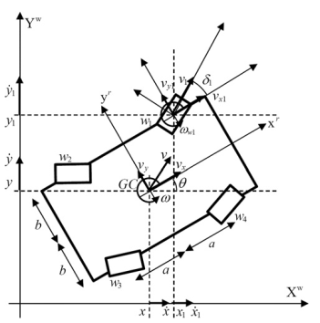

> 参考: [paper](Kinematics_dynamics_and_control_design_of_4WIS4WID.pdf)
### 构型说明
四个带机械限位的独立舵轮, 主要有平移， 自转， 边走边转等模式。

#### 主要参数
- 车体坐标下左前轮距离X轴距离: b
- 车体坐标系下左前轮距离Y轴距离: a
- 左前轮车体坐标($x_1$, $y_1$) = (b, a)
- 右前轮车体坐标($x_2$, $y_2$) = (-b, a)
- 左后轮车体坐标($x_3$, $y_3$) = (b, -a)
- 右后轮车体坐标($x_4$, $y_4$) = (-b, -a)
- 车体坐标系下左前轮距离原点距离: k = $\sqrt{b^2 + a^2}$
- 轮子(左前， 右前， 左后， 右后)车体坐标系下的航向角: $\delta_1$, $\delta_2$, $\delta_3$, $\delta_4$
- 车体在世界坐标系下的旋量: $(V_x, V_y, \omega)$
### 运动学模型
> 思路: 车体的速度与自身旋转的速度叠加
$$
\begin{equation}
\begin{aligned}
    v_{xi} = v_i \ cos(\delta_i) = V_{x} - y_i \ \omega \\
    v_{yi} = v_i \ sin(\delta_i) = V_{y} + x_i \ \omega \\
\end{aligned}
\end{equation}
\tag{1.1}
$$
将上面的式子整理为矩阵形式(共4个轮子)
$$
\begin{equation}
P_{8x3}\left[ \begin{array}{c}
V_x \\
V_y  \\
\omega 
  \end{array} \right]=
X_{8x4}\left[ \begin{array}{c}
v_1\\
v_2\\
v_3\\
v_4\\
  \end{array} \right] 
\end{equation}
\tag{1.2}
$$
其中
$$
P_{8x3}=\left[ \begin{array}{ccc}
1 & 0 & -b\\
0 & 1 & a\\
1 & 0 & -b\\
0 & 0 & -a\\
0 & 0 & b\\
0 & 0 & -a\\
0 & 0 & b\\
0 & 0 & a\\
  \end{array} \right]
$$
$$
X_{8x4}=\left[ \begin{array}{cccc}
c(\delta_1) & 0 & 0 & 0\\
s(\delta_1) & 0 & 0 & 0\\
0 & c(\delta_2) & 0 & 0\\
0 & s(\delta_2) & 0 & 0\\
0 & 0 & c(\delta_3) & 0\\
0 & 0 & s(\delta_3) & 0\\
0 & 0 & 0 & c(\delta_4)\\
0 & 0 & 0 & s(\delta_4)\\
  \end{array} \right]
$$

其中$c(\cdot)$, $s(\cdot)$ 分别表示余弦和正弦函数。
又根据矩阵论相关知识， 对$P_{8x3}$进行求伪逆:
$$
P^+=\frac{1}{4}\left[ \begin{array}{ccc}
1 & 0  & 1 & 0 & 1  & 0 & 1 & 0 \\
0 & 1  & 0 & 1 & 0 & 1 & 0 & 1 \\
-b / K & a / K & -b / K & -a / K & b / K & -a / K & b / K & a / K \\
  \end{array} \right]
$$
其中$K = (a^2 + b^2) = k^2$
对公式(1.2)左右左乘$P^+$, 得到: 
$$
\begin{equation}
\begin{aligned}
    \left[ \begin{array}{ccc}
    V_x \\
    V_y \\
    \omega 
    \end{array} \right]= \frac{1}{4}
    \left[ \begin{array}{cccc}
    c(\delta_1) & c(\delta_2) & c(\delta_3) & c(\delta_4)\\
    s(\delta_1) & s(\delta_2) & s(\delta_3) & s(\delta_4)\\
    W_1 & W_2 & W_3 & W_4\\
    \end{array} \right]\left[ \begin{array}{c}
    v_1\\
    v_2\\
    v_3\\
    v_4\\
  \end{array} \right] 
\end{aligned}
\end{equation}
\tag{1.3}
$$

其中$W_i = (-y_ic(\delta_i) + x_is(\delta_i)) / K$

式1.3即为四舵轮底盘的正运动学公式， 对其求逆即为逆运动学公式(左乘X伪逆即可)
### 运动学公式的线性化
令$T=[V_x, V_y, \omega]^T, \delta=[\delta_1, \delta_2, \delta_3, \delta_4]^T, v=[v_1, v_2, v_3, v_4]^T$, 则式(1.3)可以写为如下形式:
$$
\begin{equation}
\begin{aligned}
    T &= f(\delta, v) \\ 
    &= \frac{1}{4}\left[ \begin{array}{cccc}
    c(\delta_1) & c(\delta_2) & c(\delta_3) & c(\delta_4)\\
    s(\delta_1) & s(\delta_2) & s(\delta_3) & s(\delta_4)\\
    W_1 & W_2 & W_3 & W_4\\
    \end{array} \right] v
\end{aligned}
\end{equation}
\tag{1.4}
$$
对式(1.4)在($\overline{\delta}, \overline{v}$)进行一阶泰勒展开， 可以得到:
$$
\begin{equation}
\begin{aligned}
    \overline{T} + \Delta T &= f(\overline{\delta}, \overline{v}) + \frac{\partial f}{\partial \delta} \Delta \delta + \frac{\partial f}{\partial v} \Delta v \\ 
    &= \frac{1}{4}\left[ \begin{array}{cccc}
    c(\overline{\delta_1}) & c(\overline{\delta_2}) & c(\overline{\delta_3}) & c(\overline{\delta_4})\\
    s(\overline{\delta_1}) & s(\overline{\delta_2}) & s(\overline{\delta_3}) & s(\overline{\delta_4})\\
    \overline{W_1} & \overline{W_2} & \overline{W_3} & \overline{W_4}\\
    \end{array} \right] \Delta v \\
  +& \frac{1}{4}\left[ \begin{array}{cccc}
    -\overline{v_1}s(\overline{\delta_1}) & -\overline{v_2}s(\overline{\delta_2}) & -\overline{v_3}s(\overline{\delta_3}) & -\overline{v_4}s(\overline{\delta_4}) \\
    \overline{v_1}c(\overline{\delta_1}) & \overline{v_2}c(\overline{\delta_2}) & \overline{v_3}c(\overline{\delta_3}) & \overline{v_4}c(\overline{\delta_4}) \\
     (b*s(\overline{\delta_1})+a*c(\overline{\delta_1}))\overline{v_1}/K & (b*s(\overline{\delta_2})-a*c(\overline{\delta_2}))\overline{v_2} /K & (-b*s(\overline{\delta_3})-a*c(\overline{\delta_3}))\overline{v_3}/K & (-b*s(\overline{\delta_4})+a*c(\overline{\delta_4}))\overline{v_4}/K\\
    \end{array} \right] \Delta \delta \\
\end{aligned}
\end{equation}
\tag{1.5}
$$
### QP问题构造
#### 代价函数矩阵

#### 约束矩阵

### 考虑舵轮模型的运动学MPC

### 考虑舵轮模型的动力学MPC

