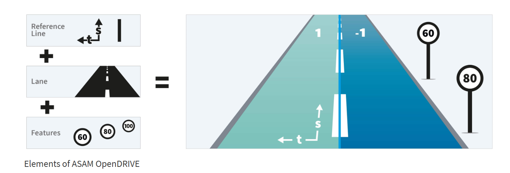

### Core Concept
- 基本元素

# OpenDRIVE 一天速成学习计划

## 📌 学习目标与时间规划

本资料旨在帮助具有一定软件或自动驾驶背景的工程师，在一天内快速理解 OpenDRIVE 地图格式的基本结构、核心概念及工具使用。

建议学习时间：6-8 小时，划分为：

- **上午**：理解结构与语义
- **中午**：示例文件分析
- **下午**：工具操作与脚本实践

---

## 📘 OpenDRIVE 核心结构总览

OpenDRIVE 是基于 XML 的道路格式，主要由以下结构组成：

- `<OpenDRIVE>`：根节点
- `<road>`：道路定义，包含平面线型、高程、车道等
  - `<planView>`：道路平面（line、arc、spiral）
  - `<elevationProfile>`：高程信息
  - `<lanes>`：车道组
  - `<signals>`：信号灯 / 交通标志
  - `<objects>`：道路附属物（如障碍、灯杆）

OpenDRIVE 使用 `s-t`（沿道路弧长方向、横向）坐标系定义所有位置。

---

## 📌 地图语义元素讲解

- `laneSection`：描述某段 `road` 上的车道结构，包含左 / 中 / 右 `lane`。
- `lane`：每条车道包含其 ID、类型、方向、宽度等属性。
- `signal`：定义位置、类型（限速 / 红绿灯）、可见性等。
- `object`：用于静态障碍物建模，可设置尺寸与位置。

---

## 🔍 实战示例讲解

- **示例文件结构阅读**：推荐用 XML 编辑器（如 VS Code + 插件）打开 `.xodr` 文件。
- **示例片段**：

```xml
<road name="MainRoad" length="100.0" id="1">
  <planView>
    <geometry s="0.0" x="0.0" y="0.0" hdg="0.0" length="100.0">
      <line/>
    </geometry>
  </planView>
</road>
```

