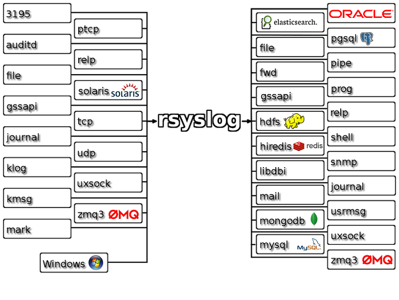

远程log服务器

### basic concept
- 是linux自带的可采集多个设备(IP)的中心日志服务器(centerizing log files)。
- server-clients架构(通常为消费者-生产者模式)
- Rsyslog为其多线程版本， 性能更好


### 安装部署
0. `linux` 系统自带`rsyslog`(`syslog`的守护进程)
1. 服务器端配置
配置主文件
```/etc/rsyslog.conf
# provides TCP syslog reception
#module(load="imtcp")
#input(type="imtcp" port="514")
## 通过udp协议进行传输
# provides UDP syslog reception
module(load="imudp")
input(type="imudp" port="514")
```
定制配置文件
```/etc/rsyslog.d
# Use default timestamp format 
$ActionFileDefaultTemplate RSYSLOG_TraditionalFileFormat
$template myFormat,"%timestamp% %fromhost-ip% %syslogtag% %msg%\n"
$ActionFileDefaultTemplate myFormat
# seperate log based on ip
$template RemoteLogs,"/var/log/rsyslog/nav_logs/%fromhost-ip%/%fromhost-ip%_%$YEAR%-%$MONTH%-%$DAY%.log"
# no local log
:fromhost-ip, !isequal, "127.0.0.1" ?RemoteLogs
```
> 可以通过`$HOST`设置文件/文件夹前缀以区分不同机器人
2. 客户端配置
省略主配置文件， 只需要打开`UDP/TCP`协议即可
定制配置文件:
```/etc/rsyslog.d/default.conf
$ModLoad imfile
$InputFileName /tmp/nav_log/log.communication_bridge.log
$InputFileTag communication
$InputFileStateFile communication
$InputFileSeverity debug
$InputFileFacility local0
$InputRunFileMonitor
local0.* @192.168.99.196 #远程服务器ip
```
3. 重启并设置开机自启服务
```bash
sudo systemctl restart rsyslog.service 
sudo systemctl enable rsyslog.service
```