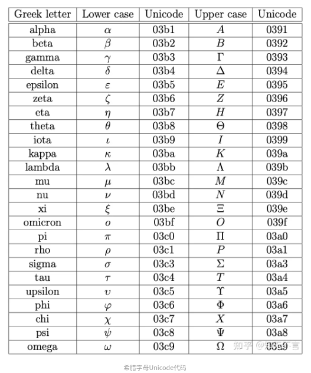

1. 输入希腊字符
>ref: https://zhuanlan.zhihu.com/p/609061223

点击输入字符后按住快捷键‘‘Ctrl+U’’, 然后输入希腊字符点unicode码，回车即可。常用希腊字符unicode码如下:

2. 上标\下标
在下拉菜单中选择“文本和字体”选项，或者使用快捷键Ctrl+Shift+T。 在弹出的文本和字体设置窗口中，可以看到“上**标**”和“**下标**”的选项