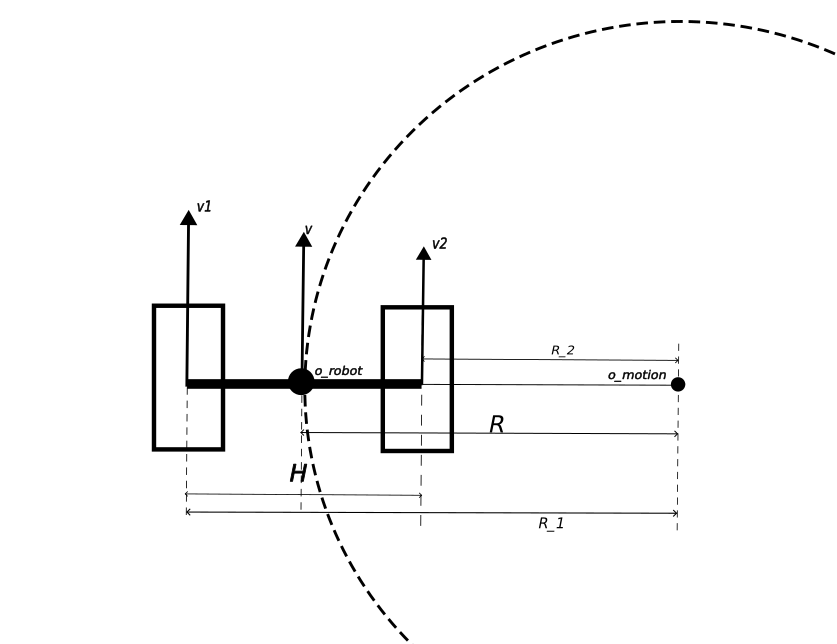
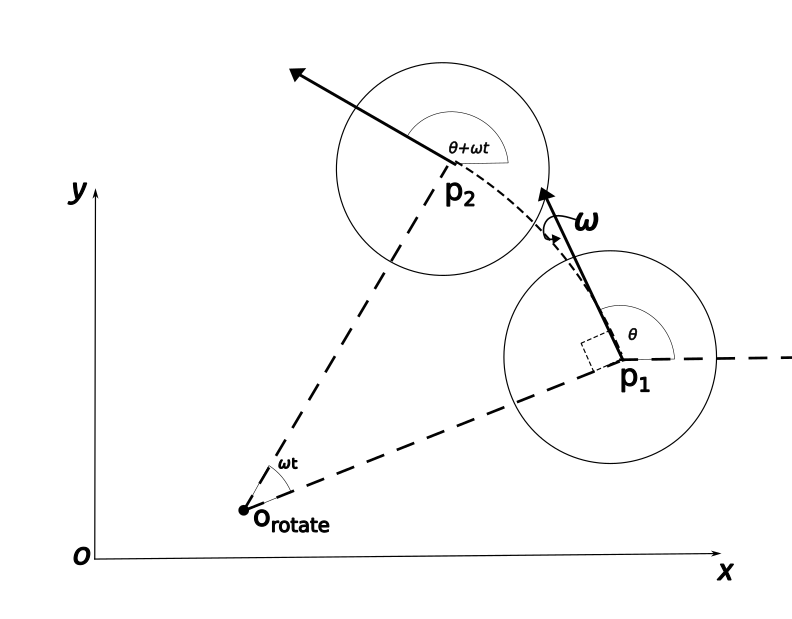
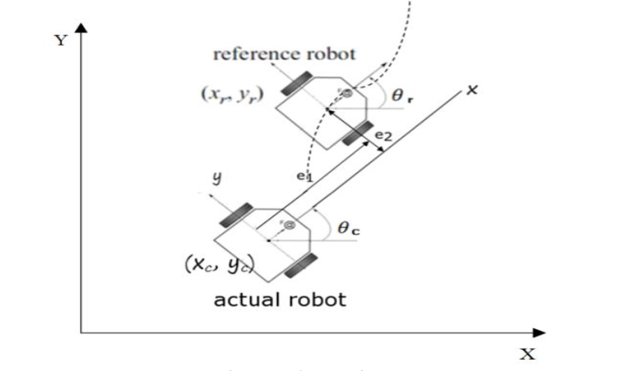
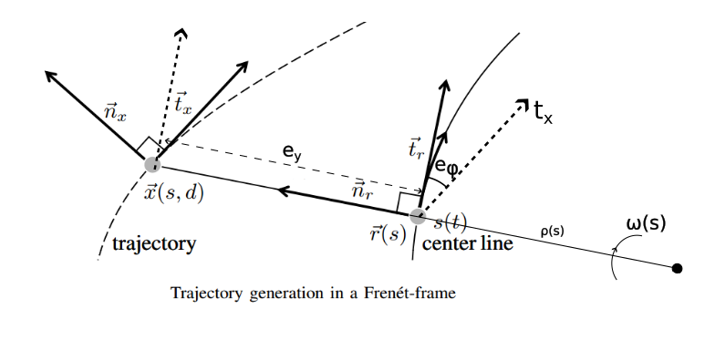

- key word: differential drive motion， error model
### reference
> [小鱼ROS：机器人模型](https://fishros.com/d2lros2/#/humble/chapt6/get_started/7.%E6%9C%BA%E5%99%A8%E4%BA%BA%E8%BF%90%E5%8A%A8%E5%AD%A6%E4%BB%8B%E7%BB%8D)
> [Probalilistic Robotics:5.3.3]

#### 运动形式
轮式机器人一种常见的构型如下，由两个独立驱动的轮子驱动(有一个或多个随动轮来支撑)，如下图所示:

机器人可能在做直线运动或圆弧运动：
1.  当$v_1$=$v_2$时:
	 机器人作直线运动，此时$o_{motion}$位于无穷远处，$v$=$v_1$=$v_2$ 
2.  当$v_1$!=$v_2$时：
- 当$v_1$与$v_2$为同方向时， 机器人绕远处圆心$v_{motion}$，做圆周运动
	 机器人作圆弧运动，此时有
$$
	\omega=\frac{v_2}{R-\frac{H}{2}}=\frac{v_1}{R+\frac{H}{2}}=\frac{v}{R}
$$
其中$H$为两个驱动轮的距离， $R$为两轮中心的运动半径。
- 当$v_1, v_2$异号或其中一个为零时:
	差动机器人作绕自身中心的自转(因为力矩中心位于机器人两轮中心)，机器人中处的线速度为零，其角速度为：
$$
	\omega = \frac{2(v_1-v_2)}{H}
$$
通过上式可求解差速机器人作圆周运动时两轮速度与两轮中心处的$v, w$之间的解算关系。
- 已知$v_1,v_2$求解$v,w$称作正运动学:
$$\left\{\begin{matrix}
 \omega = \frac{v_1-v_2}{H}
\\ v={\omega}*R=\frac{(v_1+v_2)}{2}
\\ R = \frac{H(v_1+v_2)}{2(v_1-v_2)}
\end{matrix}\right.$$
- 已知$v,w$求解$v_1,v_2$称作逆运动学:
$$\left\{\begin{matrix}
 v_1 = (R+\frac{H}{2})\omega \\
 v_2 = (R-\frac{H}{2})\omega \\
 R = \frac{v}{\omega}
\end{matrix}\right.$$
上面便是机器人当中的正逆解的概念，也完成了轮速与运动线速度与角速度之间的推导。

> 机器人点运动控制指令$(v, \omega)$便可解算为差速机器人点两个轮子点速度指令$(v_1, v_2)$，该计算逻辑可以设计为独立的低层驱动内。

#### 运动更新模型
#####  直线运动更新
将运动分解为直线运动位置更新+圆弧运动角度更新两部分，其运动更新模型可写为以下模式（通常用在有高频率点里程计位置点应用中）：
$$\left\{\begin{matrix}
 \dot{x} = v*cos(\phi)
\\ \dot{y} = v*sin(\phi)
\\ \dot{\phi} = \omega
\\ \dot{v} = a
\end{matrix}\right.$$
> 如果用上述运动模型去做轨迹追踪，可能还需要考虑圆弧运动约束$R=\frac{v}{\omega}$

##### 圆弧运动更新
实际上，上述直线运动更新是简化的。因为差速机器人只要有$\omega!=0$那么就是在做圆弧运动。下面介绍以圆弧运动进行运动更新：

1. 通过$p_1$位置$(x_1, y_1, {\theta}_1)$，求解其旋转点坐标:
$$\left\{\begin{matrix}
 x_{rotate} = x_1-R*sin(\pi-{\theta}) = x_1-Rsin\theta \\
 y_{rotate} = y_1-R*cos(\pi-{\theta}) = y_1+Rcos\theta \\
 R = \lvert \frac{v}{\omega} \rvert
\end{matrix}\right.$$
2. 然后通过旋转中新坐标更新$p_2$点坐标:
$$\left\{\begin{array}{l}
 x_2=x_{rotate}+R*sin(\pi-({\theta}+{\omega}t)) = x_{rotate}+Rsin(\theta+{\omega}t)=x_1-Rsin\theta+Rsin(\theta+{\omega}t) \\
 y_2 = y_{rotate}+R*cos(\pi-({\theta}+{\omega}t)) = y_{rotate}-Rcos(\theta+{\omega}t)=y_1+Rcos\theta-Rcos(\theta+{\omega}t) \\
 \theta_2 = \theta_1 + {\omega}t
 R = \lvert \frac{v}{\omega} \rvert
\end{array}\right.$$
> 该更新模型适用于里程计的更新
##### 误差更新模型
>  ref: [paper](Differential-Drive Mobile Robot Control Design based-on Linear Feedback Control Law)

机器人追踪到目标点时的位姿用reference robot($(x_r, y_r, {\omega}_r,v_r)$)表示如下图所示：

当前车辆车辆位姿为$(x_c, y_c, {\omega}_c,v_c)$.
误差模型有两种表示方式：
- 将路径上点追踪点投影到车辆本地坐标系中，路径点在车辆坐标系中的横坐标即为纵向误差$e_1$, 纵坐标即为横向误差$e_2$.
- 将车辆坐标投影到路径点上， 车辆在路径点本地坐标中的横坐标即为纵向误差$e_1$, 纵坐标即为纵向误差$e_2$.
> 本质上这两中误差模型是一样的，差别仅在于符号.

下面以第一种形式（将路径点投影到车辆坐标系中）进行误差跟踪模型的推导。
将轨迹点投影到车辆坐标系可表达为:
$$
\left[ \begin{array}{c}
e_1 \\
e_2  \\
e_3
  \end{array} \right]=
\left[ \begin{array}{ccc}
cos\theta_c & sin\theta_c & 0\\
-sin\theta_c & cos\theta_c & 0 \\
0 & 0 & 1 
  \end{array} \right] *
\left[ \begin{array}{c}
x_r-x_c \\
y_r-y_c  \\
\theta_r-\theta_c  
\end{array} \right] 
$$
对上式展开求导得以下形式：
$$
\begin{aligned}
\dot{e}_1&=-sin{\theta}_c*{\omega}_c*(x_r-x_c)+cos{\theta}_c*(v_{xr}-v_{xc})+cos{\theta}_c*{\omega}_c*(y_r-y_c)+sin{\theta}_c(v_{yr}-v_{yc}) \\
&={\omega}_c*\begin{matrix}\underbrace{-sin{\theta}_c*(x_r-x_c)+cos{\theta}_c*(y_r-y_c)} \\ e_2\end{matrix}+\begin{matrix}\underbrace{cos\theta_c*v_{xr}+sin\theta_c*v_{yr}} \\ v_r\ project\ to\ v_c\end{matrix}-\begin{matrix}\underbrace{(cos\theta_c*v_c*cos\theta_c + sin\theta_c*v_c*sin\theta_c) }\\ v_c \end{matrix} \\
&=w_c*e_2+v_r*sin(e_3)-v_c
\end{aligned}
$$
经过类似整理，写为矩阵形式：
- todo:补充投影关系。

$$
\left[ \begin{array}{c}
\dot{e}_1 \\
\dot{e}_2  \\
\dot{e}_3
  \end{array} \right]=
\left[ \begin{array}{cc}
cos(e_3) & 0\\
sin(e_3) & 0 \\
0  & 1 
  \end{array} \right] *
\left[ \begin{array}{c}
v_r \\
w_r  \\
\end{array} \right] 
+
\left[ \begin{array}{cc}
-1 & e_2\\
0 & e_1 \\
0  & -1 
  \end{array} \right] *
\left[ \begin{array}{c}
v_c \\
w_c  \\
\end{array} \right] 
$$
> 其中$w_r=curvature*v_r$可以根据跟踪曲线进行计算。
###### 将车辆坐标投影到轨迹点上点误差模型
只需要将$(v_r,w_r)$与$(v_c,w_c)$的系数矩阵对调即可:

$$
\left[ \begin{array}{c}
\dot{e}_1 \\
\dot{e}_2  \\
\dot{e}_3
  \end{array} \right]=
\left[ \begin{array}{cc}
cos(e_3) & 0\\
sin(e_3) & 0 \\
0  & 1 
  \end{array} \right] *
\left[ \begin{array}{c}
v_c \\
w_c  \\
\end{array} \right] 
+
\left[ \begin{array}{cc}
-1 & e_2\\
0 & e_1 \\
0  & -1 
  \end{array} \right] *
\left[ \begin{array}{c}
v_r \\
w_r  \\
\end{array} \right] 
$$
##### SL坐标系(Frenet坐标系)下的差动模型
>  ref: [paper](Optimal Trajectory Generation for Dynamic Street Scenearios in a Frenet Frame)
SL坐标系介绍参见[[Frenet frame]]
运动状态可以表示为(相比于时域模型增加了曲率k信息):
$$
z(s) = {[e_{phi}(s), e_y(s), k(s)]}^T
$$
该状态可投影到笛卡尔坐标系:
$$
\chi=[x(s),y(s),\phi(s)]^T
$$
Frenet坐标系下的轨迹表示如下图所示:

> 源图片来源[Optimal Trajectory Generation for Dynamic Street Scenearios in a Frenet Frame] fig.2

由上面差速模型可知时域运动模型为:
$$
\left\{\begin{matrix}
\dot{e_{\phi}} = \dot{\phi} - \dot{\phi}_s \\
\dot{e_y} = v*sin(e_\phi) \\
\end{matrix}\right.
$$
下面把时域运动模型转换到Frenet空间域中:
定义空间域中的一阶导数表示$x^{'}=\frac{dx}{ds}$， 时域内的导数为$\dot{x}=\frac{dx}{dt}$, 根据求导链式法则可得$x^{'}=\frac{\frac{dx}{dt}}{\frac{ds}{dt}}=\frac{\dot{x}}{\dot{s}}$
定义$v_s$为运动物体的速度$v$在其对应SL坐标的S轴上的投影(即参考线或中心线上对应点的切线方向投影)。
由上图可知(假设无滑移情况):
$$
\begin{equation}
\begin{aligned}
v_s(s)&=(\rho(s)-e_y(s))\dot{\phi_s(s)} \\
	 &=v(s)cos(e_{\phi}(s))
\end{aligned}
\end{equation}
$$
其中$\phi_s(s)$为参考线上的角速度.
由上式可以求得:
$$
\begin{equation}
\begin{aligned}
\dot{s}&=\rho_s(s)\dot{\phi_s}(s)=\rho_s(s)*\frac{v_s(s)}{\rho_s(s)-e_y(s)} \\
&=\frac{\rho_s(s)v(s)cos(e_{\phi}(s))}{\rho_s(s)-e_y(s)}
\end{aligned}
\end{equation}
$$
故SL坐标系下的运动方程为:
$$
\left\{\begin{matrix}
e_{\phi}^{'} = \frac{\dot{e_{phi}}}{\dot{s}} = \frac{\dot{\phi}(\rho_s -e_y)}{\rho_s{v}cos{e_\phi}}-{\phi_s}^{'} = \frac{\kappa(\rho_s-e_y)}{\rho_s{cos(e_\phi)}} -{\phi_s}^{'}\\
e_y^{'} = \frac{\dot{e_y}}{\dot{s}} = \frac{tan{e_\phi}(\rho_s-e_y)}{\rho_s} \\
\end{matrix}\right.
$$
注意到上面的运动公式已经与速度解耦。
> $\kappa$应该如何处理 ??

#### SL坐标系(Frenet坐标系)下ackman小车运动方程:
经过类似推倒可得:
$$
\left\{\begin{matrix}
e_{\phi}^{'} = \frac{\dot{e_{phi}}}{\dot{s}} = \frac{tan(\delta)*(\rho_s -e_y)}{\rho_s{v}cos{e_\phi}*l}-{\phi_s}^{'} = \frac{\kappa(\rho_s-e_y)}{\rho_s{cos(e_\phi)}} -{\phi_s}^{'}\\
e_y^{'} = \frac{\dot{e_y}}{\dot{s}} = \frac{tan{e_\phi}(\rho_s-e_y)}{\rho_s} \\
\end{matrix}\right.
$$
从上面可以看出，若以曲率k作为参数则可以将差动机器人及ackman小车的横向运动模型统一起来。

