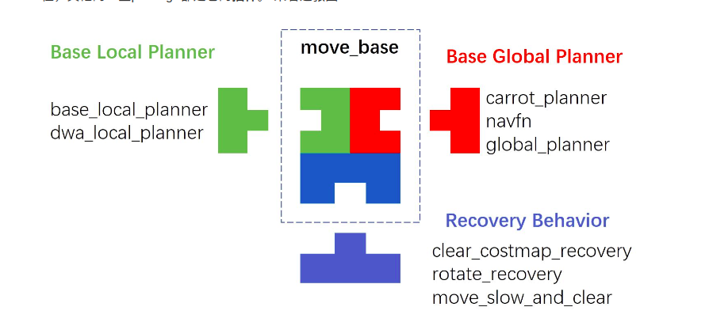

## Nav1
### concepts

### archtect

#### 外部接口
##### amcl
基于概率方法的定位, 即粒子滤波算法。
##### map server
用来管理和加载静态地图。
#### 模块
由move_base类抽象实现(nav_core)，具体实现由其子模块实现。

##### global_planner
规划全局路径
- free
- graph
- dijstra
- DWA
- carot
##### local_planner
避障

##### costmap
- 全局地图（静态）global_costmap
- 局部地图（动态）local_costmap
costmap分为三个图层：
1. static map layer: 用于存储全局occuppy grid map
2. obstacle may layer: 用于存储传感器感知到的动态障碍物信息，其中又可分为以下两个子图层：
	- 2D obstacle layer
	- 3D voxel layer(需要由三维信息)
3. Inflation map layer: 用于存储根据障碍物膨胀后的地图信息， 用于最终cost的更新
- footprint: 机器人尺寸信息（可理解为机器人在xy平面里的投影）,用于计算碰撞半径。
##### recovery_behaviors

## Nav2
