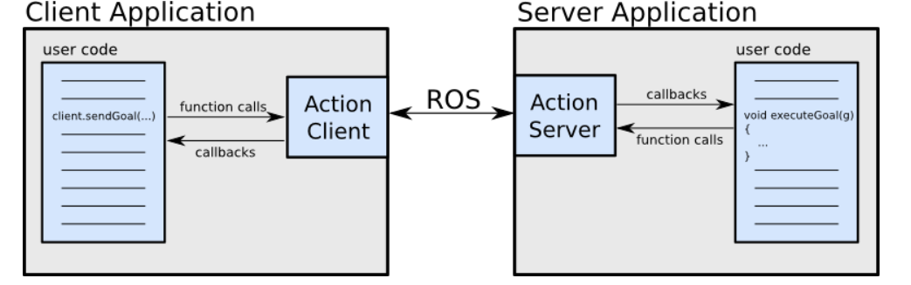

### concepts

### comunication
#### message
#### action
action主要用在需要异步执行某些操作的时候（不需要阻塞等待），进行的通信机制。client也可以取消任务。

action的通信协议定义在.action文件中, 由goal, feedback, results构成。格式如下:
```.action
#goal definition
int32 order
---
#result definition
int32[] sequence
---
#feedback
int32[] sequence
```

#### service