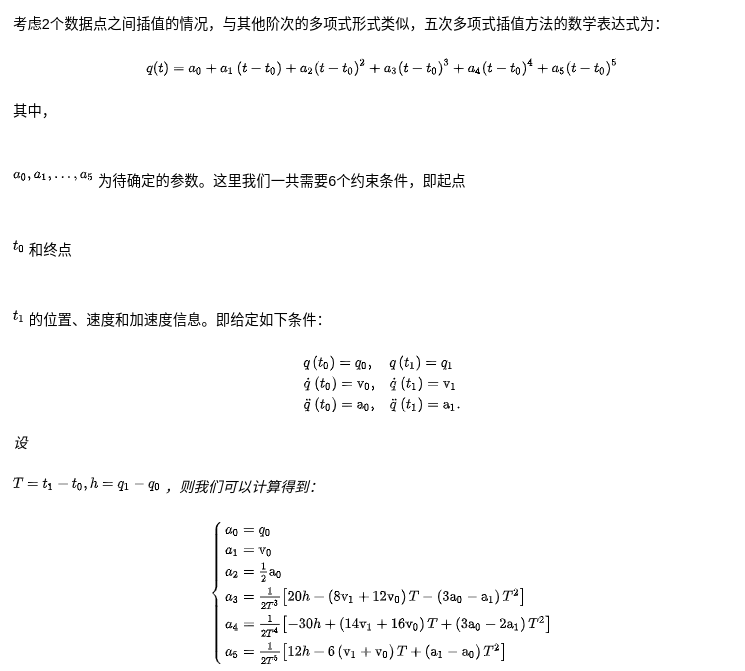

### 参考
#### 书籍
Trajectory Planning for Automatic Machines and Robots

### core concept
平滑的本质是差值。
#### 贝塞尔曲线
#### B样条曲线
- B样条曲线的本质是多段贝塞尔曲线的拼接 
#### Spline
#### cubic spline(三次多项式插值)

##### third-party
[tk::spline](https://github.com/ttk592/spline)
#### NURBS

#### 优化方法
##### Tension smooth

## 速度平滑
1. 用匀加减速度模型进行更新 
2. 优化求解
3. 多项式平滑
#### 五次多项式平滑

### mini-snap