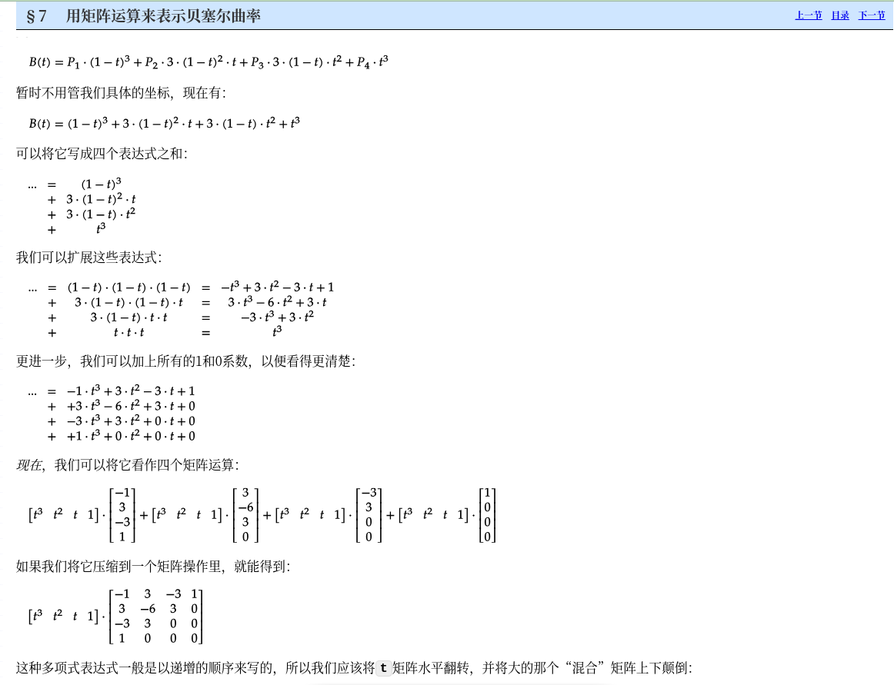

### 参考
#### 书籍
Trajectory Planning for Automatic Machines and Robots

### core concept
平滑的本质是差值, 其插值平滑后的结果都是不同阶次的参数多项式。
- 如果使用比例参数插值，那么得到的就是贝塞尔曲线及其衍生曲线。
- 如果使用的是曲率参数，那么得到的就是螺旋线
#### 贝塞尔曲线
##### 一般方程
$$
C_{bezier} = \sum_{t=0}^n{
\left( \begin{array}{c}
n \\
i \\
  \end{array} \right)(1-t)^{n-i}t^i*P(i)
}
$$
- 矩阵形式

> 上图来源
[BezierInfo](https://pomax.github.io/BezierInfo-2/zh-CN/index.html)
#### B样条曲线
- B样条曲线的本质是多段贝塞尔曲线的拼接 
假设有n+1个控制点$P_i$, 维度为m的节点向量$U=\{u_0, u_1\cdots, u_m\}$, 曲线阶数为p， 则提供的向量节点(用来控制各点的"影响范围")。(其中节点向量通常为人为指定)
- 一般方程
1. 定义Bezier基函数用以计算各控制点系数 
$$
N_{i, 0}(u) = 
\left\{ \begin{array}{cc}
1 & ,u_i <= u <= u_{i+1} \\
0 & ,other \\
  \end{array} \right.
$$
$$
N_{i,p}(u)=\frac{u-u_i}{u_{i+p}-u_i}N_{i,p-1}(u)+\frac{u_{i+p+1}-u}{u_{i+p+1}-u_{i+1}}N_{i+1,p-1}(u)
$$
注意到基函数为递归定义的方式,第i个控制点的系数仅与$\{ u_i, u_{i+1}\cdots, u{i+p} \}$有关, 或者反过来说$(u_i, u_{i+1})$上的插值点仅与$P_{i-p}, P_{i-p-1}, \cdots, P_{i}, P_{i+1}, \cdots, P_{i+p}$共$2p+1$个点有关
2. B样条曲线方程
$$
C(u)= \sum_{t=0}^n{N_{i,p}P_i}
$$

> TODO: 实现一个经过所有控制点的版本作为练习, 每个控制点都需要使用p次

#### Spline
#### cubic spline(三次多项式插值)

> ref
[tk::spline](https://github.com/ttk592/spline)
#### NURBS
- 也是一种b样条曲线，区别在于路径中间点及曲率等信息可以进一步调整。
#### 优化方法
##### Tension smooth

## 速度平滑
1. 用匀加减速度模型进行更新 
2. 优化求解
3. 多项式平滑
#### 五次多项式平滑

### mini-snap