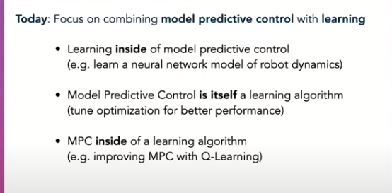

### 当前研究趋势

### 概述
#### mpc控制器的设计思路

### 运动模型建模
考虑如下车辆运动模型：
$$\left\{\begin{matrix}
 \dot{x} = v*cos(\phi)
\\ \dot{y} = v*sin(\phi)
\\ \dot{\phi} = \omega = \frac{v*tan(\delta)}{L}
\\ \dot{v} = a
\end{matrix}\right.$$
该运动模型推导参见[[多车辆运动学公式推导]]。其中$v$为车辆速度(矢量，未必为车头方向)， $a$为车辆纵向加速度，$\omega$为转弯的角速度， $\delta$为前轮转角， $\phi$为车辆航向角。
上式中选取后轮轮轴中心，作为车辆坐标原点。
若以车辆重心为坐标原点，则其运动方程如下(该模型适应高速场景)：
$$
\left\{\begin{matrix}
 \dot{x} = v*cos(\phi+\beta) \\
 \dot{y} = v*sin(\phi+\beta) \\
 \dot{\phi} = \omega = \frac{v*cos(\beta)}{l_f + l_r}tan\delta&=\frac{v}{l_r}sin\beta \\
 \dot{v} = a \\
 \beta=arctan(\frac{l_r}{l_f+l_r}tan\delta)
\end{matrix}\right.
$$

其中$\beta$为重心处的速度与车辆纵轴的的夹角, $l_r$为汽车重心到后轮的距离， $l_r$为汽车重心到前轮的距离。
### 运动模型线性化
定义系统状态$z=[x, y, \phi, v]^T$, 控制向量为$u=[a, \delta]^T$。
则上面运动方程可以写为：
$$
\begin{equation}
\begin{aligned}
\dot{z}=f(z,u)&=\frac{\partial{f}}{\partial{z}}z+\frac{\partial{f}}{\partial{u}}u+C=A{\times}z+B{\times}u+C\\
&=\left[ \begin{array}{cccc}
\frac{\partial{f_1}}{\partial{x}} & \frac{\partial{f_1}}{\partial{y}} & \frac{\partial{f_1}}{\partial{\phi}} & \frac{\partial{f_1}}{\partial{v}} \\

\frac{\partial{f_2}}{\partial{x}} & \frac{\partial{f_2}}{\partial{y}} & \frac{\partial{f_2}}{\partial{\phi}} & \frac{\partial{f_2}}{\partial{v}} \\
\frac{\partial{f_3}}{\partial{x}} & \frac{\partial{f_3}}{\partial{y}} & \frac{\partial{f_3}}{\partial{\phi}} & \frac{\partial{f_3}}{\partial{v}} \\
\frac{\partial{f_4}}{\partial{x}} & \frac{\partial{f_4}}{\partial{y}} & \frac{\partial{f_4}}{\partial{\phi}} & \frac{\partial{f_4}}{\partial{v}} \\
  \end{array} \right]{\times}z \\
&+\left[ \begin{array}{cccc}
\frac{\partial{f_1}}{\partial{a}} & \frac{\partial{f_1}}{\partial{\delta}} \\
\frac{\partial{f_2}}{\partial{a}} & \frac{\partial{f_2}}{\partial{\delta}} \\
\frac{\partial{f_3}}{\partial{a}} & \frac{\partial{f_3}}{\partial{\delta}} \\
\frac{\partial{f_4}}{\partial{a}} & \frac{\partial{f_4}}{\partial{\delta}} \\
  \end{array} \right]{\times}u + C\\
&=\left[ \begin{array}{cccc}
 0 & 0 & -v*sin(\phi) & cos(\phi) \\
 0 & 0 & v*cos(\phi) & sin(\phi) \\
 0 & 0 & 0 & \frac{tan(\delta)}{L} \\
 0 & 0 & 0 & 0 \\
  \end{array} \right]{\times}z \\
&+\left[ \begin{array}{cccc}
0 & 0 \\
0 & 0 \\
0 & \frac{v}{L*cos^2(\delta)} \\
0 & 1 \\
  \end{array} \right]{\times}u + C\\
\end{aligned}
\end{equation}
$$
其中
$$
C=\dot{z} -Az+Bu=\left[ \begin{array}{cccc}
v*sin{\phi}*\phi \\
-v*cos{\phi}*\phi  \\
-\frac{v}{L*cos^2{\delta}}\delta \\
0 \\
  \end{array} \right]
$$

### 运动状态方程离散化
采用前向欧拉法对上述线性方程进行离散化。
$$
\begin{equation}
\begin{aligned}
z_{k+1}&=z_k+f(z_k, u_k){\times}dt=z_k+(A{\times}z_k+B{\times}u_k+C){\times}dt\\
&=(I+A{\times}dt)z_k+(B{\times}dt)u_k + C*dt\\
&=\overline{A}z_k+\overline{B}u_k + \overline{C}
\end{aligned}
\end{equation}
$$
> 问题一：是否意味着输入的trajectory上的点也是时间均匀的
>       solution 1: 将路径点上的速度设置为相同（比如1m/s）
>       solution 2: 在路径点上带上时间点信息(这样就知道dt了)
> 问题二： 线性化传递函数离线性化点越远，则偏差越大此时A矩阵是否为变值
##### 离散化方法
- 前向欧拉法
- 后向欧拉法
- 双向欧拉法 
### 优化目标函数推导
#### 状态矩阵的增广形式(待补充)
$$
\left[ \begin{array}{c}
z_{k+1} \\
u_{k+1}  \\
  \end{array} \right]=
\left[ \begin{array}{cc}
\overline{A} & \overline{B}\\
0 & I \\
  \end{array} \right] *
\left[ \begin{array}{c}
z_k \\
u_k  \\
\end{array} \right] +
\left[ \begin{array}
\overline{B} \\
I  \\
\end{array} \right]*\Delta{u}
$$
> 问题： 如何用增广矩阵构造cost函数
#### 形式一(Condensed Format)
定义未来p个周期(预测步长)内预测的系统状态为：
$$
X_k=\left[ z_{k|k}^T, z_{k+1|k}^T, \dots, z_{k+p-1|k}^T  \right]^T
$$
定义到达未来p个周期内预测的系统输入为：
$$
U_k=\left[  u_{k|k}^T, u_{k+1|k}^T,\dots, u_{k+p-1|k}^T   \right]
$$
则由上述离散状态转移方程可以写出未来p个状态的状态转移方程：
$$ \begin{equation} \begin{aligned}
z_{k+1|k}&=\overline{A}z_k+\overline{B}u_k\\
z_{k+2|k}&=\overline{A}z_{k+1|k}+\overline{B}u_{k+1|k} \\
		&={\overline{A}}^2z_k+\overline{A}{\times}\overline{B}u_k+\overline{B}u_{k+1|k} \\
		&\dots \\
z_{k+p|k}&={\overline{A}}^p{\times}z_{k+p-1|k}+{\overline{A}}^{p-1}{\times}{\overline{B}u_k}+{\overline{A}}^{p-2}{\times}{\overline{B}}u_{k+1}+\dots+\overline{A}^{p-p}\times\overline{B}u_{k+p-1|k}
\end{aligned}
\end{equation}
$$
将上式写为矩阵形式：
$$
\begin{equation}
\begin{aligned}
X_{k+1}&=\Phi\times{X_k}+\Theta\times{U_k} \\
	   &=\left[ 
		   \begin{array}{}   
		   \overline{A} \\
		   \overline{A}^2 \\
		   \vdots \\
		   \overline{A}^p
		   \end{array} 
	   \right ]_{4p\times{4}}\times{X_k} 
	   &+\left[ 
		   \begin{array}{cccc}   
		   \overline{A}^{1-1}\overline{B} & \dots & 0 & 0 \\
		   \overline{A}^{2-1}\overline{B} & \overline{A}^{1-1}\overline{B} & \dots & 0\\
		   \vdots & \vdots & \ddots & \vdots\\
		   \overline{A}^{p-1}\overline{B} & \overline{A}^{p-2}\overline{B} & \dots & \overline{A}^{p-p}\overline{B}
		   \end{array} 
	   \right ]_{4p\times{4}}\times{U_k} 
\end{aligned}
\end{equation}
$$
定义预定的控制目标(步长为p)为：
$$
R_k=\left[ r_{k}^T, r_{k+1}^T, \dots, r_{k+p-1}^T  \right]^T
$$
这里的$r_k$为路径点，需要根据采样周期dt进行插值处理。
定义优化目标代价函数为：
$$
J(U_k)=(X_{k+1}-R_{k+1})^TQ(X_{k+1}-R_{k+1})+U_k^TW_1U_k+(U_k-U_{k-1})^TW_2(U_k-U_{k-1})
$$
将上面的$X_k$的状态转移方程带入上式，整理得以下二次型：
$$
J(u_k)=\frac{1}{2}U_k^THU_k+FU_k 
$$
其中：
$$
\begin{equation}
\begin{aligned}
\left \{\begin{matrix}
		H=2({\Theta}^TQ\Theta+W_1+W_2) 
		\\ F^T=\frac{1}{2}E^TQ\Theta-D
		\\ E=\Phi{X_k}-R_k
		\\ D=U_{k-1}^T(W_2+W_2^T)
		\end{matrix} \right .
\end{aligned}
\end{equation}
$$
上式可调用线性求解器进行求解析解，对$U_k$可以添加输入限制。
TODO: 这种类型的实现目前还不多，可以尝试自己封装一个库。
#### 形式二(Non-Condensed Format), 构造法
#### 参考
-  [MPC cast to osqp](https://robotology.github.io/osqp-eigen/md_pages_mpc.html)
-  [osqp求解器](https://osqp.org/docs/solver/index.html)
该形式直接利用$J(u_k, x_k)$进行构造，容易实现。下面简要描述构造过程：
OSQP求解器求解的是一类QPs(quadratic programs)问题,其形式如下：
$$
\begin{equation}
\begin{aligned}
&minimize \quad (\frac{1}{2}{z^T}Pz+{q^T}z) \\
&subject\ to \quad l \leq {A_c}z \leq u 
\end{aligned}
\tag{1}
\end{equation}
$$
其中$z$为优化变量， $P$为半正定矩阵 ， $A_c$为约束矩阵。
而上述MPC的通常代价函数为：
> 如果考虑也可以将$(u_k-\overline{u}_{k-1})$中的$\overline{u}_{k-1})$, 为上一步的控制序列的求解结果，当做已知量即可以根据后文很方便地进行构造，为了说明的方便此处省略该项的代价。

$$
\begin{equation}
\begin{aligned}
J(x_k, u_k)&=(x_N-r_N)^TQ_N(x_N-r_N) \\
&+\sum_{k=0}^{N-1} (x_k-r_k)^TQ(x_k-r_k)+\sum_{k=0}^{p-1}u_k^TR_1u_k \\
subject\ to \quad & x_{k+1}=Ax_k+Bu_k \\
& x_{min} \leq x_k \leq x_{max} \\
& u_{min} \leq u_k \leq u_{max} \\
& x_0=\overline{x} \\
& u_{-1}=\overline{u} \\
\end{aligned}
\tag{2}
\end{equation}
$$
其中$Q_N$为终端约束(terminal constraint)， 通常是为了让求解结果收敛到优化目标$x_r$;
$Q$为过程约束(stage constraint), 其维度为4x4;
$R_1$为对控制量及控制量变化的约束其维度为2x2;
$N$为预测步长;
$p$为控制步长;
$\overline{x}$为初始状态。
> 注意： 形式二中的代价函数将$(x_k, u_k)$作为求解器要优化的变量，而形式一则只优化$u_k$序列。
##### 构造代价函数为OSQP求解形式
下面将上述优化目标$J$及其约束构造为式(1)要求的形式(为了理解方便，后面的矩阵都将注释维度, x维度假定为4x1, u维度假定为2x1): 
构造$P, q^T$矩阵,式(2)中$x_k-x_r$可以展开并忽略常数项可以整理为如下形式： 
设$z=[x_1, x_2,\cdots, x_N,u_0, u_1,\cdots,u_p]_{(4*N+2*p)*1}^T$
$$
\begin{equation}
\begin{aligned}
J(x_k,u_k)&=x_N^T{Q_N}x_N+\sum_{k=1}^{N-1}x_k^T{Q}x_k + \sum_{k=0}^{N-1}u_k^T{R_1}u_k-2Q_N{r_N}-2Q\sum_{k=0}^{N-1}r_k\\
&=z^Tdiag(Q,\ldots,Q,Q_N,R_1,\cdots,R_1)_{(4*N+2*p)*(4*N+2*p)}z \\
&+2[Qr_1, Qr_2,\cdots, Qr_{k-1}, Q_N{r_k}, 0, \cdots, 0]*z
\end{aligned}
\end{equation}
$$
上面的式子便为osqp求解器要求的形式。
##### 约束矩阵的构建
事实上，约束矩阵即为(2)式中的约束条件的矩阵表达，其中值得注意的是其中等式约束的表达也采用了不等式的形式:
$$
\begin{equation}
\begin{aligned}
&\overline{x} \leq x_0 \leq \overline{x} \\
&0 \leq Ax_k+Bu_k+C-x_{k+1} \leq 0
\end{aligned}
\end{equation}
$$
构造的约束矩阵$A_c$, 如下:
$$
\begin{equation}
\begin{aligned}
&[-\overline{x},-C,\dots,-C,x_{min},\dots,x_{min},u_{min},\dots ,u_{min}]^T \leq \\ 
&\left[ 
	\begin{array}{ccccc|ccccc}   
-I & 0 &\cdots & \cdots  & 0 & 0 &\cdots  & \cdots & \cdots &0 \\
A  & -I & \ddots & & \vdots  & B & \ddots  & & &\vdots \\
0 & A  & -I & \ddots &\vdots & 0 & \ddots &  \ddots && \vdots \\
\vdots & \ddots & \ddots & \ddots & 0 & \vdots & \ddots & B & \ddots & \vdots\\
0 & \cdots & 0 & A & -I & 0 & \cdots & 0 & 0 & 0 \\ \hline
I & 0 & \cdots & \cdots & 0 & 0 & \cdots & \cdots & 0 \\
0 & I & \ddots &  & \vdots & \vdots &  &  & \vdots \\
\vdots & \ddots & \ddots & \ddots & \vdots & \vdots &  &  & \vdots \\
\vdots &  & \ddots & \ddots & 0 & \vdots & &  & \vdots \\
0 & \cdots & \cdots & 0 & I & 0 & \cdots & \cdots & 0 \\ \hline
0 & \cdots & \cdots & \cdots & 0 & I & 0 & \cdots & 0 \\
\vdots &  &  &  & \vdots & 0 & I & \ddots & \vdots \\
\vdots &  &  &  & \vdots & \vdots & \ddots & \ddots & 0 \\
0 & \cdots & \cdots & \cdots & 0 & 0 & \cdots & 0 & I \\
	\end{array} 
\right ]z \\
   
&\leq[-\overline{x},-C,\dots,-C,x_{max},\dots,x_{max},u_{max},\dots ,u_{max}]^T 
\end{aligned}
\end{equation}
$$
### 优化目标求解 
对于形式一，可以利用线性求解器求得解析解。
对于形式二， 可以利用QP(Quadratic Programming)问题求解器求最优解（本质为凸优化问题）

### 其他考虑因素
1. 系统延时
2. 定位精度与定位频率
3. 追踪路径是否平滑
4. 在嵌入式设备上使用可以利用代码生成实现高实时
5. 如果状态量不可测得，则需要利用卡尔曼滤波进行估计
6. 对于差速小车而言，由于其转弯半径可以接近0，需要考虑圆弧运动限制: $v/R < {\omega}_{max}$
