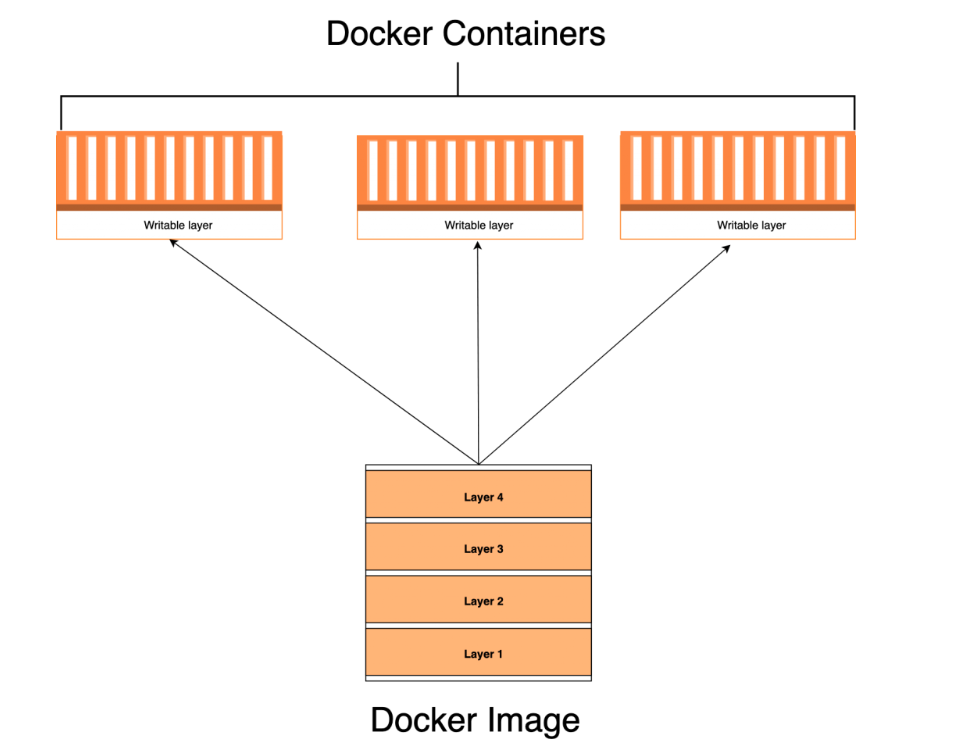

### core concept
#### containers and images
- A Docker Image is a template of instructions used to create containers
- Docker containers are instances of Docker images, major difference between Docker containers and images is that containers have a writable layer.You can see a Docker container as an instance of a Docker image:

- 镜像拉取
```bash
docker pull [镜像名称]
docker pull ubuntu:18.04
```
- 镜像运行
```bash 
docker run -itd [镜像名称] /bin/bash
# 参数说明
-it # 以命令行交互的方式进入
-d # 以后台方式运行，这样退出docker后docker运行的镜像不会退出
-v [宿主机绝对路径文件夹/文件]：[镜像绝对路径文件夹]
-e [环境变量] # 像镜像导出环境变量
-- net=host # 将镜像的网络与宿主机的网络绑定（换言之，镜像网络并不会有自己独立的IP地址，类似于交换机的模式）
--hostname haloworld #以指定访客帐号进入docker
```
- 启动镜像并挂载宿主机目录
```bash
docker run -itd -v [宿主机绝对目录]：[容器绝对目录] [镜像name or ID] /bin/bash
```
- 查看正在运行的镜像
```bash
docker ps -a
```
- 进入某个运行中的镜像命令行
```bash
docker exec -it [container ID] -w [default workdir] env hLANG=C.UTF-8 /bin/bash
# env LANG=C.UTF-8 设置docker 命令行支持中文环境
# -w(workdir)， 设置默认的进入docker后的默认目录
```
- 列出本机docker 镜像
```bash
docker images
```
- 删除docker 镜像
```bash
docker rmi -f [container ID] # -f为强制删除
```
- 退出命令行交互
```bash
exit
```
- 本机文件与宿主机文件的相互拷贝
```bash
docker cp [宿主机文件] [container name:容器绝对路径] # 从宿主机向docker 拷贝
docker cp [container name:容器绝对路径] [宿主机文件]  # 从docker向宿主机拷贝
```
- 保存docker的修改
```docker bash
docker commit [容器名或ID] [镜像名：tag] # tag 类似于版本
```
- 删除本地镜像
``` docker bash
docker image rm [镜像名或ID]
```
- 镜像上传到公共仓库
```docker bash
# 登录自己的仓库帐号
docker login
# 修改仓库名称
docker tag <docker image name>:tag <docker hub id>/<docker image name>:tag
# 仓库上传
docker push <docker hub id>/<docker image name>:tag
```
- 清空所有未在使用的镜像
```bash
docker rmi $(docker images -q) -f
```
- 清空所有镜像缓存
```bash
docker system prune --all
```
- 查看某镜像的完整ID
```bash
docker images --digests
```
- 删除所有untagged镜像
```bash
docker images -a | grep none | awk '{ print $3; }' | xargs docker rmi --force
```
- 备份docker image到压缩包
```bash
docker save [docker name] > [name].tar
```
- 从.tar备份文件加载镜像
```bash
docker load -i [.tar file name]
```
- docker image 重命名
```bash
docker tag [old image name] [new image name]
```
- docker container 重命名
```bash
docker rename [old container name] [new containner name]
```
- docker container 运行日志查看(可以方便的查看容器退出原因)
```bash
docker logs [container name]
```
 

### docker file
```bash
docker build <script>
```
#### docker file 常用命令

|命令行名称|说明||
|---|---|---|
|RUN|执行linux命令| 最常用|  
|COPY [source file] [target file]|将对应的本机的文件或目录(可以是相对路径),拷贝到docker中|注意dockerfile中复制目录时，目录内的纵深关系会被破坏为平级关系   |
|ADD|与COPY类似|推荐只使用COPY， ADD在拷贝压缩包时会自动解压缩, ADD的源地址可以是网络地址|
|WORKDIR|设置当前工作路径|1. 设置过workdir后所有命令在执行相对路径时，都是相对workdir而言的; 2.如果workdir指定的路径不存在则会自动创建该目录|
|USER|设置当前用户||
|CMD|进入容器后默认执行该命令|可以被docker run 进行覆盖,当执行脚本时，需要将脚本权限更改为可执行|
|ENTERPOINT|docker run image后面的命令会被当做参数传递给ENTERPOINT|当与CMD同时存在时会将CMD指令当做参数传递给ENTERPOINT，当用户覆盖了CMD时将用户指定的命令当做参数|
#### docker image 构建
1. 通过dockerfile构建
```Dockerfile demo 
# a docker file for test
#构建image的基础，如果本机没有则从远程dockerhub拉取
FROM ubuntu:20.04 
# 设置进入docker后的工作目录
WORKDIR /home/westwell/workspace/workout/ #设置workdir后所有单条命令的默认当前目录
# 拷贝相关的配置文件到镜像中 
COPY lanelet2.pdf /home
# 运行linux中的命令
RUN <linux command>
```
2.  运行docker build 进行构建
```bash
docker build -t haloworld/docker-test:workdir .
```
3. 运行结果如下：
```output
Sending build context to Docker daemon  611.3kB
Step 1/3 : FROM ubuntu:20.04
 ---> a0ce5a295b63
Step 2/3 : WORKDIR .
 ---> Running in 0c93af2519d2
Removing intermediate container 0c93af2519d2
 ---> d765d22b25aa
Step 3/3 : COPY lanelet2.pdf /home
 ---> 9bbc23e5d288
Successfully built 9bbc23e5d288
Successfully tagged haloworld/docker-test:latest
```
### docker-compose
#### 安装
1. 下载可执行文件
```bash
sudo curl -L "https://github.com/docker/compose/releases/download/v2.2.2/docker-compose-$(uname -s)-$(uname -m)" -o /usr/local/bin/docker-compose #官方github
sudo curl -L https://get.daocloud.io/docker/compose/releases/download/v2.4.1/docker-compose-`uname -s`-`uname -m` > /usr/local/bin/docker-compose #国内源
```
2. 添加权限
```bash
sudo chmod +x /usr/local/bin/docker-compose
```
3. 添加链接（以便在当前用户执行）
```bash
sudo ln -s /usr/local/bin/docker-compose /usr/bin/docker-compose
```
4. 测试是否安装成功
```bash
docker-compose version
```
#### 配置文件

#### 运行

### Q&A
1.   安装docker后出现permission denied错误
-  原因：docker 进程使用Unix Socket而不是TCP端口。而默认情况下，Unix socket属于root用户，需要root权限才能访问。
 解决方案（来源：菜鸟教程）
（1）命令行都用sudo执行
（2）docker守护进程启动的时候，会默认赋予名字为docker的用户组读写Unix socket的权限，因此只要创建docker用户组，并将当前用户加入到docker用户组中，那么当前用户就有权限访问Unix socket了，进而也就可以执行docker相关命令。
```bash
sudo groupadd docker #添加docker用户组 
sudo gpasswd -a $USER docker #将登陆用户加入到docker用户组中 
newgrp docker #更新用户组 
docker ps #测试docker命令是否可以使用sudo正常使用
## 替代方案docker rootless
sudo apt-get install -y uidmap
dockerd-rootless-setuptool.sh install
```
2. 一些国外镜像pull慢
解决方案又两种:
	 - 配置命令行翻墙代理(clash), 详见
	 - 使用第三方加速服务
> [public-image-mirror](https://github.com/DaoCloud/public-image-mirror)
> 将 ghcr.io 替换为 ghcr.nju.edu.cn 即可
3. 在docker 中使用宿主机的翻墙代理
- 配置docker代理`~/.docker/config.json`
```json
{
 "proxies":
 {
   "default":
   {
     "httpProxy": "http://127.0.0.1:7890",
     "httpsProxy": "http://127.0.0.1:7890",
     "noProxy": "localhost"
   }
 }
}
```
- 重启docker服务
```bash
sudo systemctl daemon-reload
sudo systemctl restart docker
```
- 进入docker时使用`host`模式
```BASH
docker run -it --network=host --name=ubuntu ubuntu:18.04
```


### 备忘
个人docker 默认密码
user: 2
root: 1
### docker file
通过docker file构建容器
### dockerignore
忽略用户目录的配置文件：在根目录新建一个.dockerignore的文件并添加以下内容：
```config file
.git
.gitignore
node_modules
npm-debug.log
Dockerfile*
docker-compose*
README.md
LICENSE
.vscode
```

### 跨平台使用docker image
#### 使用qemu进行硬件模拟
- 缺点： 性能有所损失
- 优点： 可以进行交叉编译
1. qemu的安装
要确保您的宿主机上安装了 QEMU 并启用了对应的二进制格式支持，请按照以下步骤操作：  
  
首先，安装 QEMU。在基于 Debian 的系统（如 Ubuntu）上，您可以使用以下命令进行安装：  
   
sudo apt-get update  
sudo apt-get install qemu qemu-user-static binfmt-support  
在基于 RHEL 的系统（如 CentOS、Fedora）上，您可以使用以下命令进行安装：  
   
sudo yum install qemu qemu-user-static  
接下来，验证 QEMU 是否已安装：  
   
qemu-system-aarch64 --version  
如果成功安装，您应该会看到 QEMU 版本信息。  
  
确认 binfmt-support 服务是否启用：  
   
sudo systemctl status binfmt-support  
如果服务未启用，请使用以下命令启用并启动服务：  
   
sudo systemctl enable binfmt-support  
sudo systemctl start binfmt-support  
最后，确保您的系统已注册了 ARM64 架构的二进制格式支持。运行以下命令：  
   
cat /proc/sys/fs/binfmt_misc/qemu-aarch64  
如果已启用支持，您应该会看到包含 "flags: F" 和 "interpreter /usr/bin/qemu-aarch64-static" 的输出。  
  
完成这些步骤后，您的宿主机应已准备好运行 ARM64 架构的 Docker 镜像。这意味着您可以在这些镜像中直接编译 ARM64 程序，而无需配置交叉编译。