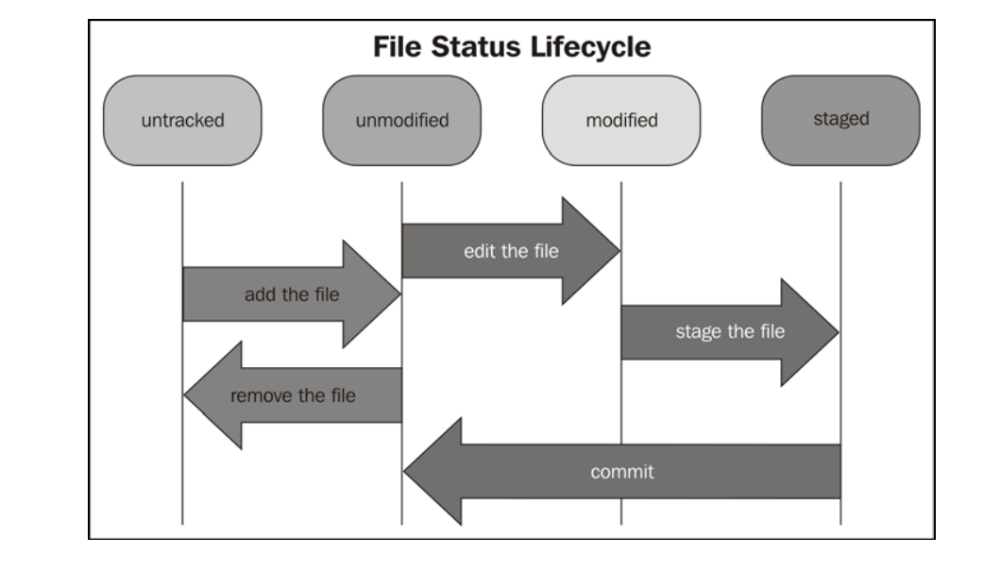
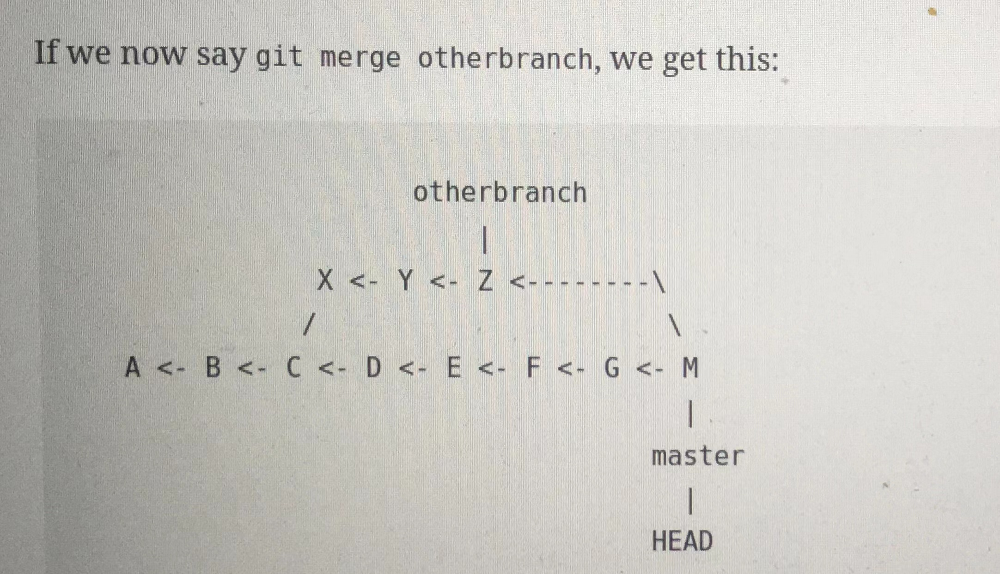

| command | discription | comment |  |
| ---- | ---- | ---- | ---- |
| git branch | 查看当前分支 |  |  |
| git commit | 提交一个修改快照 | git commit --amend 修改快照简介 |  |
| git branch -m [old-branch-name]  [new-branch-name] | 修改已经存在的分支名称 |  |  |
| git checkout -b [branch-name] | 创建新分支 |  |  |
| git remote -v | 查看远程仓库主分支 |  |  |
| git fetch | 获取远程仓库内容 |  |  |
| git checkout | 检查当前目录的内容进行校验（如果是子模块，需要在子目录进行checkout; git checkout - 返回之前的分支 | git checkout [filename or dir]将文件(夹)文件恢复到最后的commit的状态， 即撤销修改 |  |
| git checkout [分支名称] | 切换到对应的分支 | git checkout -切回到之前的分支 |  |
| git clone [仓库地址]  [指定目录] --recurse-submodules | 连带子模块进行拉取，如果拉到指定目录则不带顶层文件夹 |  |  |
| git fetch --all && git reset --hard [分支名称] && git pull | 获取所有历史分支，将head指针重置到最新master分支上 | 更安全的方法是把要更新的分支删除，然后pull | --hard选项不能轻易使用，因为会强制删除本地更改（可以改用--soft选项），且不可恢复 |
| git reset HEAD[file] | 将文件状态恢复当当前head记录的状态 |  |  |
|  | --hard HEAD ^ | 回退到上n个commit, ^有多少个n就为多少，不过回退后的commit都回呗删除（慎用！！！！！） |  |
|  | --soft HEAD ^ | 回退到上n个commit, ^有多少个n就为多少 |  |
| git revert | 撤销摸个中间commit 所做的修改 |  |  |
| git reflog | 可以查看历史git 操作记录 | 用来回退reset --hard中删除的新的分支 |  |
| git pull | 拉去当前分支最近内容并合并到本地（相当于fetch+merge） | --recurse-submodules 连带子模块一起拉取 |  |
| git push -u origin <branch_name> | 将本地分支推送到远程对应分支并关联（-u） | 后续只需要git push便可推送到对应分支 |  |
| git push origin --delete <branch_name> | 删除远程分支 |  |  |
| git push -f origin main | 回滚版本后，强制远程仓库同步回退 |  |  |
| git branch -d <branch_name> | 删除本地分支（需要退出需要删除的分支才能删除） | -D为强制删除 |  |
| git status | 查看目前分支的修改状态 |  |  |
| git log | 查看git commit 的历史记录 | git shortlog 历史记录的缩略版 --name-only 查看更改文件列表 |  |
| git merge [分支名称] | 将对应分支的修改合并到本分支 | git merge --abort: 放弃之前的merge |  |
| git reset --merge previous-commit<br>git reset --merge HEAD~1 | 回退合并成功的merge |  |  |
| git add [filename] | 将对应文件由untrack状态提升为unstage 状态（第一第创建时候）;更新最近修改（track update） |  |  |
| git rm [filename] | 将对应文件由tracked状态变为untracked状态 | 可以添加--cached选项，导致该文件不会立即删除，而是在commit之后删除 |  |
| git stash | 将将当前分支更改保存，并恢复到之前clean commit的状态 | 恢复git stash apply |  |
| git remote -v | 获取远程仓库信息 |  |  |
| git config |  | git行为配置;分为三个层级：System(--system) User(--global) Repository(--local) |  |
| git blame [filename] | 查看某个文件改动历程 |  |  |
| git bundle | 将当前仓库进行快照 |  |  |
| git submodule add https://github.com/[user]/rock rock | 添加其他远程仓库作为子模块（存在形式为子文件夹） |  |  |
| git show [commitID] --stat | 查看对应commit修改了哪些文件 |  |  |
| git diff <base branch> <to_comare branch> | 比较两个分支的内容差别 | 非常适合定位不同分支都做了那些修改 |  |
| git merge-base <base branch> <to_comare branch> | 询问两个待合并分支的common commit | 合并前先看下 |  |
| git rev-parse --short @ | 查看当前版本编号 | （如果是bf1908d）,在合并失败后可以git reset --hard bf1098d来恢复合并后的版本 |  |
| git checkout --confict diff3 [filepath] | 查看待合并的两个版本加上commit base三者之间的差异 |  |  |
| git submodule update --init --recursive | 用于首次git clone 后的子模块拉取 |  |  |
| git remote rm origin | 删除远程仓库地址 |  |  |
| git remote add origin [新仓库地址] | 删除远程仓库地址 |  |  |
| git clone [repo] --recursive | 用于首次git clone 时连带子模块拉取 |  |  |
| git show [commit] -- [filepath] | 查看某次commit多具体文件做了哪些修改 |  |  |
| git cherry-pick [commit] | 仅将单个commit内部修改的内容合并到当前分支 | 失败回退: git cherry-pick --abort |  |
| git tag -a [tag name] | 给重要阶段快照打tag以便永久记忆 | -a 打开编辑器添加注释 |  |
| git reset | 取消所有git add 的操作 |  |  |

### concepts
1. git pull = git fetch + git merge
2. 文件的状态可以分为四个阶段，如下图所示：

3. HEAD是当前分支和版本的一个指针（pointer）
4. origin为默认远程主机名称，而main(master)为默认分支名称
5. git rebase为修改当前分支切出的分支base,相当与让原来的base与新base合并（merge），然后设置为当前分支的base
6. git commit 相当于代码仓库的一份“快照”，可以回滚到较早版本
7. git merge 合并的是不同的commits, 合并后的commit有两个parrent, 待合并分支的branch base作为这次合并的common commits

> [useful ref](https://www.biteinteractive.com/understanding-git-merge/)
8. git rebase, 与git merge要解决的问题一样，都是将不同分支、版本中的修改集中起来。rebase比较危险，可能影响到被合并版本，应**非常小心**
> [useful ref](https://www.atlassian.com/git/tutorials/merging-vs-rebasing)
9. git的版本管理是每个文件中的每一行进行版本管理的，具有非常高的灵活性
10. branch 就是一系列的commits，当head指向一个具体commit 而不是branch时head会处于游离态（head detached, 也是正常状态，只需要checkout到对应分支即可）
### git workflow
#### general
1. 创建fork分支或者本地分支
2. 在该分支上作相应更改
3. 完成后git pull request到主分支
4. 主分支接受更改后，删除该分支的远程分支及本地分支。有新功能时返回1,进行新一轮的循环。
> 更新或者修改分支前都应该检查当前分支是否“干净”（所有修改都已经staged），以及与远程分支是否同步
#### fork后更新最新代码
0、 通过git status检查当前的分支是否clean,否则则应通过git stash恢复至上一个干净的版本

1、找一个空的目录下签出 fork 后的代码
git clone <fork 后仓库>
查看 remote 信息
git remote -v

2、然后添加源项目地址（距离定义为 source）
git remote add upstream <fork的源仓库>
查看 remote 信息，可以看到新增两条信息
git remote -v

3、fetch 源项目
git fetch upstream

4、合并代码
git merge upstream/master

5、把合并最新的代码推送到你的fork项目上
git push origin master

#### 远程仓库
1. 将本地仓库推送到远程空仓库
```bash
git remote add origin <remote-repository-url>
```
2. 追踪原始仓库的变更
```bash
git remote add upstream <upstream-remote-repository-url>
```
具体流程：
- 从upstream拉去最新变更
- 合并到本地
- 将本地变更与upstream变更一起推送到本仓库origin
3. 已存在的本地仓库替换远程仓库
```bash
git remote set-url origin [url]
git submodule sync# 然后修改.git/config文件中子模块的地址即可
```


#### git pull 与 git push 的默认行为
1. git 2.0后git push 的推送模式为simple（仅将当前分支推送到远程分支），而在2.0以前则为matching模式（将所有的本地-远程分支全部推送）
2. git pull = git fetch + git merge, 
#### 解决git merge的经验
git merge conflict产生的主要问题是本分支的更改（相对于创建该分支时的基类base）及远程分支相对于该base所做的变更的不同。
从长期来看，merge的时间周期越短，出现git merge conflict的可能性就越小
1. 放弃git merge，采用远程分支
```bash
git merge --abort
```
2. 修改有冲突的代码片段
可以搜索“=======”定位需要人工修改的位置。

#### 子模块管理
-  添加子模块
只需要将对应的子目录使用git add <子模块路径>， 即可（事实上父项目中仅更新了版本追踪信息）
```bash
$ git submodule add https://github.com/iphysresearch/GWToolkit.git GWToolkit
```

-  更新子模块的仓库更新(按照父模块中记录的commit进行更新)
```bash
git submodule update # 会按照主仓库中子模块的commit进行更新
```
> 注意更新后子模块目录并不会自动切换分支，需要自己手动切换
如果是第一次拉取子模块可以使用命令：
```bash
git submodule update --init --recursive
```
可以使用如下命令使子模块追踪到对应远程仓库的版本
```bash
git submodule update --recursive --remote

```
-  子模块遍历操作
```bash
git submodule foreach 'git stash' #引号内是要对所有子模块进行的操作
```
- 子模块文件夹重命名
```bash
# 较老版本
# 更新.gitmodules
git mv old_path new_path
git rm old_path
git add newpath
git submodule sync
# 最新git
git mv old_path new_path
```
```

### git config
#### git config的三个级别
1. --local 仅适用于当前仓库
2. --global 仅适用当前用户
3. --system适用于当前系统所有用户
#### 配置用户名及邮箱
```bash
git config --global user.name "guangshen.zhi"
git config --global user.email guangshen.zhi@westwell-lab.com
```
### 遇到的问题
- 终端下git status乱码问题
solution: 
```bash
git config --global core.quotepath false #termianal里可能也设置一下支持中文utf-8, 在zsh中本身就支持utf-8
```
- 修改默认编辑器
```bash
git config --global core.editor nvim
```
- 当本地分支没有远程分支时可以新建一个同名分支，然后拉取
```bash
git checkout -b <branch name>
git pull origin <branch name>
```
- http拉取设置记住密码
```bash
git config --global credential.helper store
```