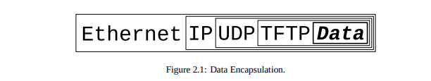

### core concept
1. 在unix标准中，万物皆文件，socket是不同计算机之间进行通信的文件。
2. socket主要有两种：
		- stream_socket, TCP协议采用，可以error_free地进行数据传输, 需维护网络连接
		- datagram_socket, UDP协议采用, 可能会出现数据丢失，但是速度快的多，无需维护网络连接
 3. TCP等网络协议模型应用了数据封装的概念，可以对数据进行高度抽象而无需关心底层细节
 